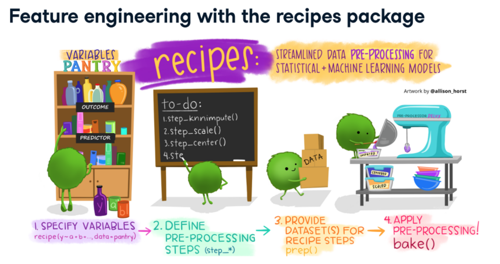
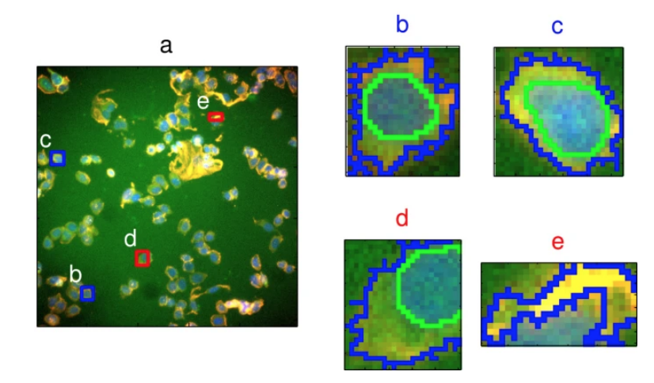

# Introduction

**Learning objectives:**

- Recognize the structure of the book
- Establish base lines for good practice
- Define feature engineering


## Structure of the book


The book is divided into two main parts:

- Feature engineering (techniques for augmenting predictors - chapters 2-9)

    * Predicting risk of Ischemic
    * Review of the PMP (predictive modeling process)
    * Exploratory visualization
    * Encoding categorical predictors
    * Engineering numeric predictors
    * Detecting interaction effects
    * Handling missing data
    * Working with profile data (time series analysis)

- Feature selection (methods for filtering the enhanced predictors - chapters 10-12)

    * Overview
    * Greedy search methods (simple filters and eliminations)
    * Golbal search methods (predictor space investigations)


## Good Practice guidelines


There are some vital steps to take to modeling:

- knowledge of the process to model
- collect appropriate data
- understand variation in the response
- select relevant predictors
- utilize a range of models


All of these are not enough when model lacks on performance.

The answer might be the in the way the predictors are presented to the model.


### What is feature engineering


> "...best re-representation of the predictors to improve model performance." (ct. Preface)

```{r 01_02, echo=FALSE}

```


**What are the possible ways to acheive a better performance?**

- transform the predictors with special functions (log/exp) 
- add an interaction term (prod/ratio)
- add a functional transformation (splines/poly)
- add a re-representation of the predictors (mean/med/standardz)
- imputing missing values (knn/bagging)

Disclaimer: Risk of Overfitting!


### Nature of modeling

```{r 01-02, echo=FALSE}
DiagrammeR::mermaid("
  graph TB
  H[Model Scoping]
  A[Inference]
  A-->C[simple models are better]
  B[Estimation]
  B-->D[a bit more complexity is allowed]
  H-->A
  H-->B
")
```

The estimation of uncertainty/noise is another very important step to take.

> "If a model is only 50% accurate should it be used to make inferences or predictions?"

The trade-off between accuracy and interpretability is important, a neural network model might be less explicable but can provide a higher level of accuracy.


**Feature engineering** is a matter of choice in finding the most suitable variable transformation for the best performance.

```{r 01-03, echo=FALSE}
DiagrammeR::mermaid("
  graph TB
  H[Model data]
  
  H-->A
  H-->B
  A[Dependent]
  A-->C(Response)
  A-->D(Outcome)
  
  B[Independent]
  
  B-->E[Predictor]
  B-->F[Feature]
  
  E-->G[as provided]
  F-->I[tranformation]
")
```


More considerations about bad model reactions to:

- multicollinarity or correlation between predictors
- missing values
- irrelevant predictors


## A model with two predictors


```{r 01-04, message=FALSE, warning=FALSE, include=FALSE, paged.print=FALSE}
library(tidyverse)
library(caret)
library(ggthemes)
library(tidymodels)
tidymodels_prefer()
```


```{r 01-05,}
data(segmentationData)
```

This example uses **segmentationData**. Data originates from an experiment from Hill et al. (2007), a study on [“Impact of Image Segmentation on High-Content Screening Data Quality for SK-BR-3 Cells.”](https://bmcbioinformatics.biomedcentral.com/articles/10.1186/1471-2105-8-340) BMC Bioinformatics.

```{r image_shapes, echo=FALSE}

```

The data set includes a **Case** vector containing **Train** and **Test** variables, with a total of 61 different vectors, about cellular structures and morphology. 

Selected for this first example are two predictors: **EqSphereAreaCh1** and **PerimCh1**.
The objective is to predict shape parameters of **poorly-segmented (PS)** and **well-segmented (WS)** cells from the **Class** variable.

```{r 01-06,echo=FALSE}
DiagrammeR::mermaid("
  graph TB
  H[Model data]
  A[outcome]
  B[predictors]

  H-->A
  H-->B
  A-->C(binary class variable)
  C-->D[poorly-segmented PS]
  C-->G[well-segmented WS]
  B-->L[numeric]
  L-->E[Area]
  L-->F[Perimeter]
")
```

This is the full list of variables in the set.

```{r 01-07, echo=FALSE}
segmentationData %>% names
segmentationData %>% dim
```

**Parsimony:**

```{r 01-08, echo=FALSE}
train <- segmentationData %>%
  filter(Case == "Train") %>%
  rename(Area = EqSphereAreaCh1, Perimeter = PerimCh1) %>%
  select(Class, Area, Perimeter) 

train %>% head

test <- segmentationData %>%
  filter(Case == "Test") %>%
  rename(Area = EqSphereAreaCh1, Perimeter = PerimCh1) %>%
  select(Class, Area, Perimeter) 
```

The dataset is already split between training and test sets, all that is to be added is cross-validation on the training set. 

```{r folds}
set.seed(2222)
folds <- vfold_cv(train, v = 10)
```

A first visualization of the relationship between the two predictors.

```{r relationship, echo=FALSE, message=FALSE, warning=FALSE, paged.print=FALSE}
ggplot(train, aes(x = Area, Perimeter)) +
  geom_point(aes(color = factor(Class)), alpha = .3, cex = 1.5) +
  geom_smooth(size = 0.5, se = F) +
  theme(legend.position = c(.1, .8)) +
  scale_colour_tableau() + 
  theme_fivethirtyeight() +
  theme(axis.title = element_text()) +
  labs(title = "Relationship between predictors", color = "Class")
```

**Check for Class imbalance of the response variable**

This would be the first level transformation of the response, this type of transformation is considered **a structural transformation**, we will see more about it later in the book.

```{r tables, comment="",echo=FALSE, message=FALSE, warning=FALSE, paged.print=FALSE}
tb_class <- table(train$Class)
pr_class <- round(prop.table(tb_class), 2)
rbind(tb_class, pr_class)
```
```{r upsamp}
up_samp_ws <- pr_class[2]
```

**Recipes**

```{r recipes}
library(themis)

log_rec_natural_units <- recipe(Class ~ Area + Perimeter, data = train) %>%
  step_upsample(Class, over_ratio = up_samp_ws)

log_rec_inverse_units <- recipe(Class ~ Area + Perimeter, data = train) %>%
  step_upsample(Class, over_ratio = up_samp_ws) %>%
  step_BoxCox(all_numeric())
```


**Workflow**
```{r workflow, comment=""}
logistic_reg_glm_spec <-
  logistic_reg() %>%
  set_engine('glm')


log_wfl_natural_units <- workflow() %>%
  add_model(logistic_reg_glm_spec) %>%
  add_recipe(log_rec_natural_units)


log_fit_natural_units <- log_wfl_natural_units %>%
  fit(train)

log_fit_natural_units %>%
  extract_fit_parsnip() %>%
  tidy()
```


**Prediction**
```{r withpred,comment=""}
with_pred_natural_units <- log_fit_natural_units %>%
  augment(test)

with_pred_natural_units %>% head
```

**Confusion Matrics**
```{r mosaics, echo=FALSE}
a <- log_wfl_natural_units %>%
  fit(train) %>%
  augment(train) %>%
  conf_mat(truth = Class, estimate = .pred_class) %>%
  autoplot() + labs(title = "training")
b <- log_wfl_natural_units %>%
  fit(test) %>%
  augment(test) %>%
  conf_mat(truth = Class, estimate = .pred_class) %>%
  autoplot() + labs(title = "test")
library(patchwork)
a + b
```

**Roc Curve**

```{r roc}
with_pred_natural_units  %>%
  roc_curve(Class,.pred_PS) %>% 
  mutate(Format = "Natural Units") %>%
  ggplot(aes(1 - specificity, sensitivity))+
  geom_line(aes(color = .threshold), size = 1)+
  geom_abline(linetype = "dashed", size = 1, color = "gray") +
  scale_colour_continuous()+
  theme_fivethirtyeight() +
  theme(axis.title = element_text())
```


**Workflow set**

Let's compare the two transformations with a `workflow_set()`:

```{r model, message=FALSE, warning=FALSE, comment="", paged.print=FALSE}
full_workflow <- workflow_set(
  models = list(logitstic = logistic_reg_glm_spec),
  preproc = list(natural_units = log_rec_natural_units,
                 inverse_units = log_rec_inverse_units))

system.time(
  grid_results <- full_workflow %>%
    workflow_map(
      seed = 1503,
      resamples = folds,
      grid = 25,
      control = control_grid(
        save_pred = TRUE,
        parallel_over = "everything",
        save_workflow = TRUE),
      verbose = TRUE)
  )

grid_results
```

```{r time, eval=FALSE, include=FALSE}
 # user  system elapsed 
 #  9.051   0.088   9.184 
```

**Roc curves for two different recipes**

```{r rocs}
roc <- grid_results %>%
  unnest(result) %>%
  unnest(.predictions) %>%
  select(wflow_id, .pred_PS, .pred_WS, .pred_class, Class) %>%
  group_by(wflow_id) %>%
  roc_curve(Class, .pred_PS) 

roc_curves <- roc %>%
  ggplot(
    aes(x = 1 - specificity, y = sensitivity, group = wflow_id, color = wflow_id)
  ) +
  geom_line(size = 0.5) +
  geom_abline(lty = 2, alpha = 0.5, color = "gray50", size = 0.8)+
  scale_color_tableau()+
  theme_fivethirtyeight()+
  theme(axis.title = element_text())
roc_curves
```


## Important concepts

- Overfitting
- Supervised and unsupervised
- Model bias and variance
- Experience and empirically driven modeling

Generalizing the main boundaries, the risk of overfitting the model is always challenged by anomalous patterns new data can hide.


### Acknowledge vulnerabilities


**To consider:**

- **small number of observations** compared to the number of predictors
- **low bias models** can have a higher likelihood of overfitting
- **supervised analysis** can be used to detect predictors significance
- **No free lunch therem** (Wolpert, 1996) - knowledge is an important part of modeling
- **variance-bias** trade-off 

    * Low variance: linear/logistic regression and PLS
    * High variance: trees, nearest neighbor, neural networks
    * Bias: level of ability to closer estimation

- **irrilevant predictors** can causing excess model variation
- be **data-driven** rather than **experience-driven**
- **big data** does not mean better data
- **unlabeled data** can improve *autoencoders* modeling
- **compensatory effect** there may not be a unique set of predictors. 


Finally, one more important consideration is to consider **Strategies for Supervised and Unsupervised feature selections**. 


**Supervised selection method** can be divided into:

- wrapper methods, such as **backwards** and **stepwise selection**
- embedded methods, such as decision tree variable selection 

**Unsupervised selection method**

- variable encoding, such as dummy or indicator variables


### The **Modeling process** 


**Few steps summary:**

a) EDA
b) summary and correlation
c) model methods evaluation
d) model tuning
e) summary measures and EDA
f) residual analysis/ check for systematic issues
g) more feature engineering
h) model selection
i) final *bake off*
j) prediction


## Predicting ridership on Chicago

This set will be widely used in the book to predict the number of people entering a train station daily.

```{r}
library(modeldata)
modeldata::Chicago %>% head
```


### Extra Resources


- [Cooking Your Data with Recipes](https://topepo.github.io/2021_11_HDSI_RUG/#1)
- Here is a nice example on how to [Compute a sliding mean](https://juliasilge.com/blog/sf-rent/) by [Julia Silge](https://juliasilge.com/)

- [caret-vs-tidymodels](https://towardsdatascience.com/caret-vs-tidymodels-how-to-use-both-packages-together-ee3f85b381c)

- [tidymodels-or-caret-how-they-compare](https://www.r-bloggers.com/2021/10/tidymodels-or-caret-how-they-compare/)


## Meeting Videos

### Cohort 1

`r knitr::include_url("https://www.youtube.com/embed/TavJRxiGDbE")`

<details>
<summary> Meeting chat log </summary>

```
01:04:45	Federica Gazzelloni:	https://topepo.github.io/2021_11_HDSI_RUG/#1
01:05:57	Jim Gruman:	thank you!!!
01:06:18	Federica Gazzelloni:	- Here is a nice example on how to [Compute a sliding mean](https://juliasilge.com/blog/sf-rent/) by [Julia Silge](https://juliasilge.com/)

- [caret-vs-tidymodels](https://towardsdatascience.com/caret-vs-tidymodels-how-to-use-both-packages-together-ee3f85b381c)

- [tidymodels-or-caret-how-they-compare](https://www.r-bloggers.com/2021/10/tidymodels-or-caret-how-they-compare/)
01:06:27	Ben G:	Thank you!
```
</details>

