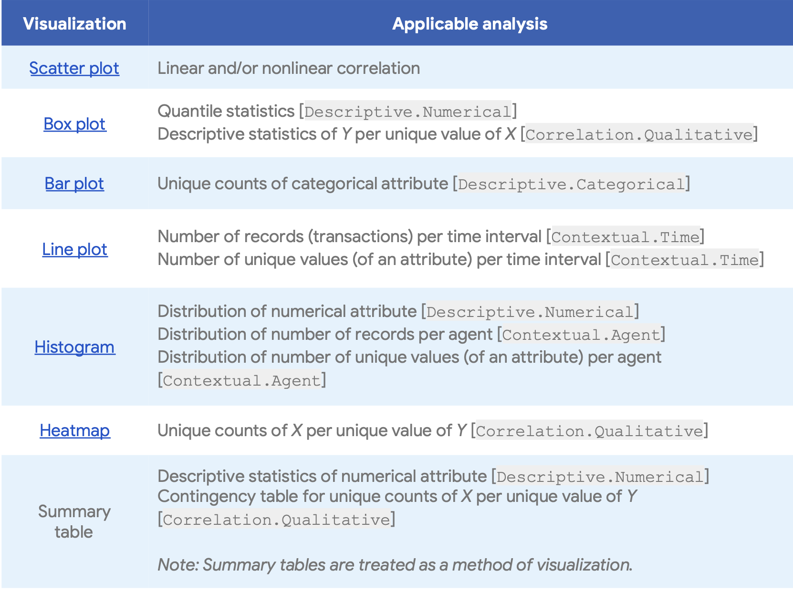
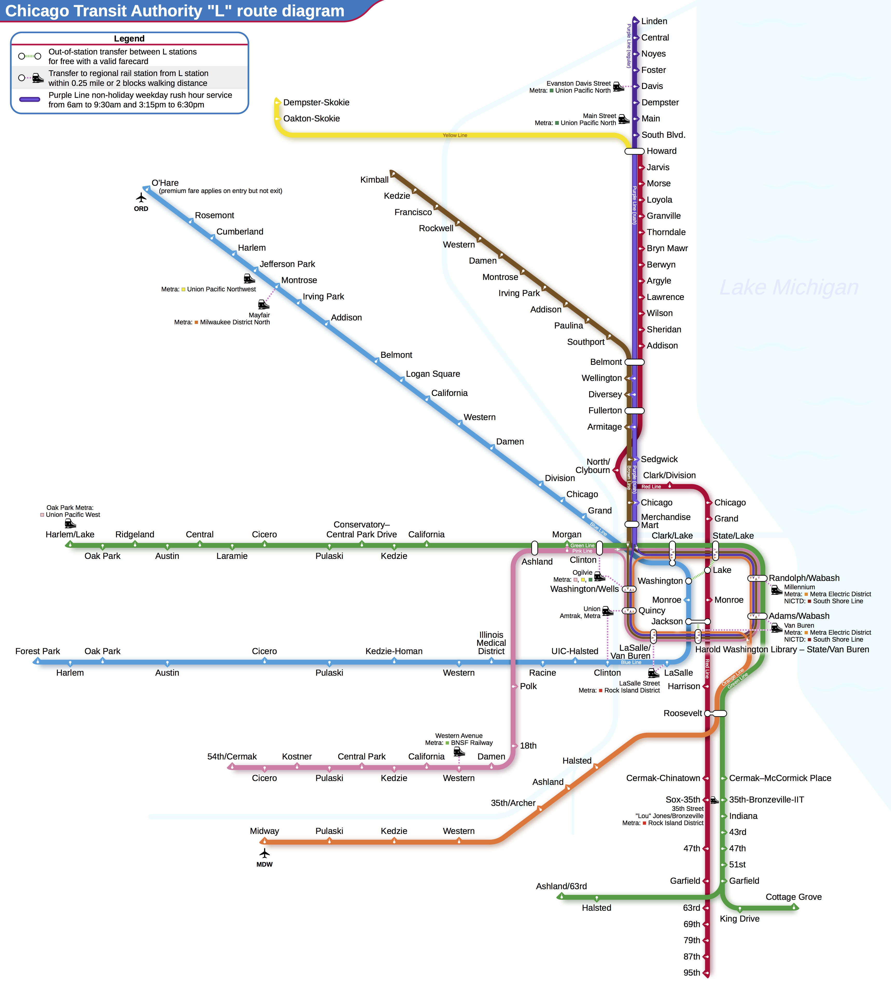
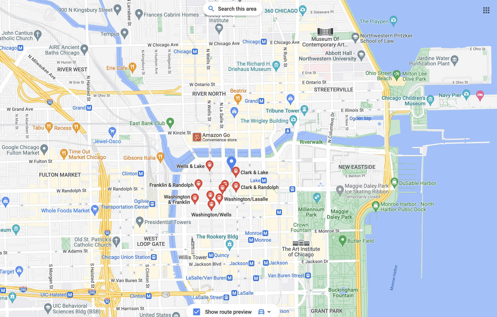
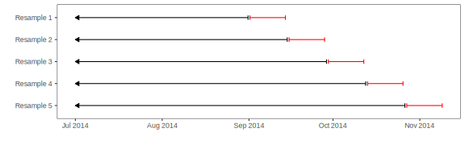

# Exploratory Visualizations

**Learning objectives:**

-   Perform exploratory data *visualization* for the Chicago train ridership and OKCupid datasets.
-   Perform univariate and bivariate visualizations for numerical variables.
-   Perform visualizations for categorical variables.
-   Perform post-modeling visualizations.

## Data Visualization Chart

{height=640px width=800px}

Another reference for data visualization using R

[Data Visualization with R](https://rkabacoff.github.io/datavis/)

## Introduction to the Chicago Train Ridership Dataset

{height=800px width=800px}

Our interest is predicting the ridership at the Clark/Lake in the Chicago Loop.

{height=800px width=800px}

## Chicago Train Ridership dataset

```{r load-packages}
library(tidyverse)
library(lubridate)
library(plotly)
library(patchwork)
library(here)
library(heatmaply)
library(RColorBrewer)
library(skimr)
library(vcd)
library(colorspace)
library(FactoMineR)
library(caret)
```

```{r load_datasets}
load(url("https://github.com/topepo/FES/blob/master/Data_Sets/Chicago_trains/chicago.RData?raw=true"))
load(url("https://github.com/topepo/FES/blob/master/Data_Sets/Chicago_trains/stations.RData?raw=true"))
```

Create `train_plot_data`

```{r train_plot_data}
train_plot_data <- 
     training %>% 
     mutate(date = train_days) %>% 
     relocate(date, .before = everything())
train_plot_data
```

## Preliminary exploratory visualizations

Ridership line plot by month

```{r line_plot, fig.width = 10, fig.height = 10}
g1 <- train_plot_data %>% 
     select(date, rides = s_40380) %>% 
     mutate(date = floor_date(date, "month")) %>% 
     arrange(date) %>% 
     group_by(date) %>% 
     summarise(rides = sum(rides), .groups = 'drop') %>% 
     ggplot(aes(date, rides)) + 
     geom_line(size = 1) + 
     geom_smooth(method = 'loess', se = FALSE, color = 'steelblue') + 
     scale_x_date(date_labels = "%b-%Y", date_breaks  ="2 year")+
     labs(x = '', 
          y = "Rides (000's)", 
          title = 'Chicago Clark/Lake Train Station Monthly Ridership Volume (Jan 2001 - Aug 2016)'
     ) + 
     theme(axis.text.x = element_text(angle = 60, hjust = 1))

ggplotly(g1)
```

Boxplot rides by day of the week

```{r boxplot_dow}
g2 <- train_plot_data %>% 
     select(dow, rides = s_40380) %>% 
     ggplot(aes(dow, rides, fill = dow)) + 
     geom_boxplot() + 
     labs(x = '', 
          y = "Rides (000's)", 
          title = 'Chicago Clark/Lake Train Station Ridership by Day of the Week') + 
     theme(legend.position = 'none')

ggplotly(g2)
```

Violinplot rides by day of the week

```{r violinplot}
train_plot_data %>% 
     select(dow, rides = s_40380) %>% 
     ggplot(aes(dow, rides, fill = dow)) + 
     geom_violin() + 
     labs(x = '', 
          y = "Rides (000's)", 
          title = 'Chicago Clark/Lake Train Station Ridership by Day of the Week') + 
     theme(legend.position = 'none')
```

Boxplot rides by month

```{r boxplot_month}
g3 <- train_plot_data %>% 
     select(month, rides = s_40380) %>% 
     ggplot(aes(month, rides, fill = month)) + 
     geom_boxplot() + 
     labs(x = '', 
          y = "Rides (000's)", 
          title = 'Chicago Clark/Lake Train Monthly Station Ridership') + 
     theme(legend.position = 'none')

ggplotly(g3)
```

## Visualizations for Numeric Data

### Box Plots, Violin Plots, and Histograms

Understanding the distribution of the response

```{r boxplot_response}
g4 <- train_plot_data %>% 
     ggplot(aes(x = "", y = s_40380)) +
     geom_boxplot(fill = "blue", alpha = 0.5) +
     ylab("Clark/Lake Rides (x1000)") +
     theme(
          axis.title.y = element_blank(),
          axis.text.y = element_blank(),
          axis.ticks.y = element_blank()
     ) +
     coord_flip() +
     ylim(-2, 29)

ggplotly(g4)
```

```{r histogram_box_violin}
y_hist <- 
  ggplot(train_plot_data, aes(s_40380)) +   
  geom_histogram(binwidth = .7, col = "#D53E4F", fill = "#D53E4F", alpha = .5) +  
  xlab("Clark/Lake Rides (x1000)") +
  ylab("Frequency") +
  ggtitle("(a)") +
  xlim(-2,29) +
  theme(
    axis.title.x = element_blank(),
    axis.text.x = element_blank(),
    axis.ticks.x = element_blank(),
    axis.title.y = element_blank(),
    axis.text.y = element_blank(),
    axis.ticks.y = element_blank()
  )

y_box <-
  ggplot(train_plot_data, aes(x = "", y = s_40380)) +
  geom_boxplot(alpha = 0.2) +
  ylab("Clark/Lake Rides (x1000)") +
  ggtitle("(b)") +
  theme(
    axis.title.x = element_blank(),
    axis.text.x = element_blank(),
    axis.ticks.x = element_blank(),
    axis.title.y = element_blank(),
    axis.text.y = element_blank(),
    axis.ticks.y = element_blank()
  ) +
  coord_flip() +
  ylim(-2,29)

y_violin <-
  ggplot(train_plot_data, aes(x = "", y = s_40380)) +
  geom_violin(alpha = 0.2) +
  ylab("Clark/Lake Rides (x1000)") +
  ggtitle("(c)") +
  theme(
    axis.title.y = element_blank(),
    axis.text.y = element_blank(),
    axis.ticks.y = element_blank()
  ) +
  coord_flip() +
  ylim(-2,29)

y_hist / y_box / y_violin
```

-   The histogram (a) allows us to see that there are two peaks or modes in ridership distribution indicating that there may be two mechanisms affecting ridership.

-   The box plot (b) does not have the ability to see multiple peaks in the data.

-   However the violin plot (c) provides a compact visualization that identifies the distributional nuance.

### Augmenting Visualizations through Faceting, Colors, and Shapes

Distribution of daily ridership at the Clark/Lake stop from 2001 to 2016 colored and faceted by weekday and weekend.

```{r histogram_weekday_weekend}
l10_breaks <- scales::trans_breaks("log10", function(x) 10^x)
l10_labels <- scales::trans_format("log10", scales::math_format(10^.x))

all_pred %>% 
  mutate(pow = as.factor(ifelse(dow %in% c("Sat","Sun"), "Weekend", "Weekday"))) %>% 
  ggplot(aes(s_40380 * 1000, fill = pow, col = pow)) + 
  facet_wrap( ~ pow, nrow = 2, scales = "free_y") +
  geom_histogram(binwidth = .03, alpha = .5) +
  scale_fill_manual(values = c("#D53E4F", "#3ed5c4")) +
  scale_color_manual(values = c("#D53E4F", "#3ed5c4")) +
  scale_x_log10(breaks = l10_breaks, labels = l10_labels) +
  xlab("Clark/Lakes Rides") +
  ylab("Frequency") +
  theme(legend.position="none")
```

### Scatterplots

Scatterplots are numeric-to-numeric visualizations.

Example: A scatter plot of the 14-day lag ridership at the Clark/Lake station and the current-day ridership at the same station.

```{r weekday_weekend_flag}
# create 'pow' (weekend/weekday flag)
train_plot_data <- 
  train_plot_data %>% 
  mutate(
    pow = ifelse(dow %in% c("Sat", "Sun"), "Weekend", "Weekday"),
    pow = factor(pow)
  )
```

```{r scatterplot_14_lag}
train_plot_data %>% 
     select(l14_40380, s_40380, pow) %>% 
     ggplot(aes(l14_40380,s_40380, col = pow)) +
     geom_point(alpha=0.5) +
     scale_color_manual(values = c("#D53E4F", "#3ed5c4")) +
     xlab("Two-week Lag in Ridership (x1000)") +
     ylab("Current Day Ridership (x1000)") + 
     theme(legend.title=element_blank()) + 
     coord_equal()
```

-   In general, there is a strong linear relationship between the 14-day lag and current-day ridership.

-   However, there are many 14-day lag/current day pairs of days that lie far off from the overall scatter of points.

### Scatterplots - Exclude U.S. holidays

Let's filter major U.S. holidays from the `train_plot_data`.
```{r holidays}
commonHolidays <- 
  c("USNewYearsDay", "Jan02_Mon_Fri", "USMLKingsBirthday", 
    "USPresidentsDay", "USMemorialDay", "USIndependenceDay", 
    "Jul03_Mon_Fri", "Jul05_Mon_Fri", "USLaborDay", "USThanksgivingDay", 
    "Day_after_Thx", "ChristmasEve", "USChristmasDay", "Dec26_wkday", 
    "Dec31_Mon_Fri")

any_holiday <- 
  train_plot_data %>% 
  dplyr::select(date, !!commonHolidays) %>% 
  gather(holiday, value, -date) %>% 
  group_by(date) %>% 
  summarize(common_holiday = max(value)) %>% 
  ungroup() %>% 
  mutate(common_holiday = ifelse(common_holiday == 1, "Holiday", "Non-holiday")) %>% 
  inner_join(train_plot_data, by = "date")
  
holiday_values <- 
  any_holiday %>% 
  dplyr::select(date, common_holiday)

make_lag <- function(x, lag = 14) {
  x$date <- x$date + days(lag)
  prefix <- ifelse(lag < 10, paste0("0", lag), lag)
  prefix <- paste0("l", prefix, "_holiday")
  names(x) <- gsub("common_holiday", prefix, names(x))
  x
}

lag_hol <- make_lag(holiday_values, lag = 14)
```

```{r no_holiday_plot}
holiday_data <-
  any_holiday %>% 
  left_join(lag_hol, by = "date") %>% 
  mutate(
    year = factor(year),
    l14_holiday = ifelse(is.na(l14_holiday), "Non-holiday", l14_holiday)
    ) 

no_holiday_plot <-
  holiday_data %>% 
  dplyr::filter(common_holiday == "Non-holiday" & l14_holiday == "Non-holiday") %>% 
  ggplot(aes(l14_40380, s_40380, col = pow)) +
  geom_point(alpha=0.5) +
  scale_color_manual(values = c("#D53E4F", "#3ed5c4")) +
  xlab("14-Day Lag") +
  ylab("Current Day") +
  theme(legend.title=element_blank())+ 
  coord_equal()

no_holiday_plot
```

-   Filtering the holidays, the weekday scatterplot compactness improves (less outliers scattered on both sides of the cluster).

### Heatmaps

For the ridership data, we will create a month and day predictor, a year predictor, and an indicator of weekday ridership less than 10,000 rides.

```{r heatmap_data}
heatmap_data <- 
  all_pred  %>% 
  mutate(pow = as.factor(ifelse(dow %in% c("Sat","Sun"), "Weekend", "Weekday"))) %>% 
  dplyr::select(date, s_40380, pow) %>% 
  mutate(
    mmdd = format(as.Date(date), "%m-%d"),
    yyyy = format(as.Date(date), "%Y"),
    lt10 = ifelse(s_40380 < 10 & pow=="Weekday", 1, 0)
  )

# U.S. holidays
break_vals <- 
  c("01-01","01-15","02-01","02-15","03-01","03-15","04-01",
    "04-15","05-01","05-15","06-01","06-15", "07-01","07-15",
    "08-01", "08-15","09-01","09-15","10-01","10-15","11-01",
    "11-15","12-01","12-15")
```

```{r heatmap_plot}
heatmap_data %>% 
     ggplot(aes(yyyy, mmdd)) + 
     geom_tile(aes(fill = lt10), colour = "white") +
     scale_fill_gradient(low = "transparent", high = "red") +
     scale_y_discrete(
          breaks = break_vals
     ) +
     xlab("Year") +
     ylab("Month & Day") +
     theme_bw() + 
     theme(legend.position = "none")
```

This visualization indicates that the distinct patterns of low ridership on weekdays occur on and around major US holidays.

### Correlation Matrix Plots

Visualization of the correlation matrix of the 14-day lag ridership station predictors for non-holiday, weekdays in 2016.

```{r cor_mat}
cor_mat <- 
  holiday_data %>% 
  dplyr::filter(year == "2016") %>%
  dplyr::select(matches("l14_[0-9]"), pow, common_holiday) %>%
  dplyr::filter(pow == "Weekday" & common_holiday == "Non-holiday") %>%
  dplyr::select(-pow, -common_holiday) %>% 
  cor()
```

```{r cor_map}
cor_map <- 
  heatmaply_cor(
    cor_mat, 
    symm = TRUE, 
    cexRow = .0001, 
    cexCol = .0001, 
    branches_lwd = .1
  ) 

cor_map
```

- Ridership across stations is positively correlated (red) for nearly all pairs of stations.

- This means that low ridership at one station corresponds to relatively low ridership at another station, and high ridership at one station corresponds to relatively high ridership at another station.

- For feature selection, the high degree of correlation is a clear indicator that the information present across the stations is redundant and could be eliminated or reduced.

### Line plots

Monthly average ridership per year by weekday (excluding holidays) or weekend.
```{r monthly_avg_ridership}
year_cols <- colorRampPalette(colors = brewer.pal(n = 9, "YlOrRd")[-1])(16)

holiday_data %>% 
  dplyr::filter(common_holiday == "Non-holiday") %>%
  dplyr::mutate(year = factor(year)) %>%
  group_by(
    month = lubridate::month(date, label = TRUE, abbr = TRUE), 
    year, 
    pow
  ) %>%
  dplyr::summarize(average_ridership = mean(s_40380, na.rm = TRUE)) %>% 
  ggplot(aes(month, average_ridership)) +
  facet_wrap( ~ pow, ncol = 2) +
  geom_line(aes(group = year, col = year), size = 1.1) +
  xlab("") +
  ylab("Geometric Mean Ridership (x1000)") +
  scale_color_manual(values = year_cols) +
  guides(
    col = guide_legend(
      title = "",
      nrow = 2,
      byrow = TRUE
    )
  ) + 
  theme(legend.position = "top")
```

- Weekend ridership also shows annual trends but exhibits more variation within the trends for some years.

- The Weekend line plots have the highest variation during 2008, with much higher ridership in the summer.

Monthly average gas price per gallon (USD) per year.
```{r monthly_avg_gas_prices}
holiday_data %>% 
  dplyr::filter(common_holiday == "Non-holiday") %>%
  mutate(year = factor(year)) %>%
  group_by(
    month = lubridate::month(date, label = TRUE, abbr = TRUE), 
    year
  ) %>%
  dplyr::summarize(average_l14_gas_price = mean(l14_gas_price, na.rm = TRUE)) %>% 
  ggplot(aes(x = month, y = average_l14_gas_price)) +
  geom_line(aes(group = year, col = year), size = 1.3) +
  xlab("") +
  ylab("Average Gas Price/Gallon ($)") +
  scale_color_manual(values = year_cols) +
  guides(
    col = guide_legend(
      title = "",
      nrow = 2,
      byrow = TRUE
    )
  ) + 
  theme(legend.position = "top")
```

- Prices spike in the summer of 2008, which is at the same time that weekend ridership spikes.

### Principal Component Analysis (PCA)

Principal component analysis of the 14-day station lag ridership.
```{r lag_14_data}
lag_14_data <- 
  holiday_data %>% 
  dplyr::select(matches("l14_[0-9]"))

PCA_station <- prcomp(lag_14_data)

var_explained <- c(0, PCA_station$sdev ^ 2)
cumulative_var <- cumsum(var_explained)
pct_var_explained <- 100 * cumulative_var / max(cumulative_var)

var_df <- tibble(
  Component = seq_along(pct_var_explained) - 1,
  pct_var_explained = pct_var_explained
)
score_data <- 
  tibble(
    y = holiday_data$s_40380,
    year = factor(holiday_data$year),
    pow = holiday_data$pow,
    PC1 = PCA_station$x[, 1],
    PC2 = PCA_station$x[, 2],
    dow = holiday_data$dow
  )
```

```{r pca_plots}
pca_rng <- extendrange(c(score_data$PC1, score_data$PC2))

var_plot <- 
  var_df %>% 
  dplyr::filter(Component <= 50) %>% 
  ggplot(aes(x = Component, y = pct_var_explained)) +
  geom_line(size = 1.3) +
  ylim(0, 100) +
  xlab("Component") +
  ylab("Percent Variance Explained") +
  ggtitle("(a)")

score_plot12 <- 
  ggplot(score_data, aes(PC1,PC2)) +
  geom_point(size = 1, alpha = 0.25) +
  xlab("Component 1") +
  ylab("Component 2") +
  xlim(pca_rng) + ylim(pca_rng) +
  ggtitle("(b)")

score1_vs_day <- 
  ggplot(score_data, aes(x = dow, y = PC1)) + 
  geom_violin(adjust = 1.5) + 
  ylab("Component 1") +
  xlab("") + 
  ylim(pca_rng) +
  ggtitle("(c)") 

score2_vs_year <- 
  ggplot(score_data, aes(x = year, y = PC2, col = year)) + 
  geom_violin(adjust = 1.5)  + 
  ylab("Component 2") +
  xlab("") + 
  # ylim(pca_rng) +
  scale_color_manual(values = year_cols)+
  theme(legend.position = "none") +
  ggtitle("(d)") 

(var_plot + score_plot12) / score1_vs_day / score2_vs_year
```

-  The cumulative variability summarized across the first 10 components (a).

- A scatter plot of the first two principal components. The first component focuses on variation due to part of the week while the second component focuses on variation due to time (year) (b).

-  The relationship between the first principal component and ridership for each day of the week at the Clark/Lake station (c).

-  The relationship between second principal component and ridership for each year at the Clark/Lake station (d).

## Visualizations for Categorical Data: Exploring the OKCupid dataset

OkCupid is an online dating site that serves international users. Kim and Escobedo-Land (2015) describe a data set where over 50,000 profiles from the San Francisco area.
```{r load_okc}
load(url("https://github.com/topepo/FES/blob/master/Data_Sets/OkCupid/okc.RData?raw=true"))
```

First look at the dataset
```{r okc_look}
# bind 'okc_test'
okc <- okc_train %>%
  bind_rows(okc_test)
```

Skim `okc`
```{r okc_skim}
skimr::skim(okc) %>% 
  knitr::kable()
```

Plot `Class`
```{r okc_class}
okc %>% 
  ggplot(aes(Class, fill = Class)) + 
  geom_bar() + 
  theme(legend.position = 'none')
```

### Visualizing Relationships between Outcomes and Predictors

#### Outcome and Categorical Predictor

Let's plot the frequency of the stated religion, partitioned and color by the outcome (`Class`).
```{r religion_class}
binom_stats <- function(x, ...) {
  x <- x$Class[!is.na(x$Class)]
  res <- prop.test(x = sum(x == "stem"), n = length(x), ...)
  data.frame(Proportion  = unname(res$estimate), 
             Lower = res$conf.int[1],
             Upper = res$conf.int[2])
}

stem_rate <- mean(okc_train$Class == "stem")

religion_rates <- 
  okc_train %>%
  group_by(religion) %>%
  do(binom_stats(.)) %>%
  arrange(Proportion) %>%
  ungroup() %>%
  mutate(religion = gsub("religion_", "", religion),
         religion = reorder(factor(religion), Proportion))

okc_train <- 
  okc_train %>% 
  mutate(
    religion2 = gsub("religion_", "", as.character(religion)),
    religion2 = factor(religion2, levels = as.character(religion_rates$religion))
  )

bars <- 
  ggplot(okc_train, aes(x = religion2, fill = Class)) +
  geom_bar(position = position_dodge()) + scale_fill_brewer(palette = "Paired") +
  xlab("") +
  theme(legend.position = "top", axis.text = element_text(size = 8)) +
  ggtitle("(a)")

stacked_vars <-
  ggplot(okc_train, aes(x = religion2, fill = Class)) + geom_bar(position = "fill") +
  scale_fill_brewer(palette = "Paired") +
  xlab("") + ylab("Proportion") +
  theme(legend.position = "none", axis.text = element_text(size = 8)) +
  ggtitle("(b)")

ci_plots <- 
  ggplot(religion_rates, aes(x = religion, y = Proportion)) +
  geom_hline(yintercept = stem_rate, col = "red", alpha = .35, lty = 2) + 
  geom_point() +
  geom_errorbar(aes(ymin = Lower, ymax = Upper), width = .1) +
  theme(axis.text = element_text(size = 8)) +
  xlab("") +
  ggtitle("(c)")

bars / stacked_vars / ci_plots
```

Does religion appear to be related to the outcome? Since there is a gradation of rates of STEM professions between the groups, it would appear so.

#### Outcome and Numerical Predictor

Now, let's visualize the relationship between a categorical outcome (`Class`) and a numerical predictor (`essay_length`).
```{r essay_length}
l10_breaks <- scales::trans_breaks("log10", function(x) 10^x)
l10_labels <- scales::trans_format("log10", scales::math_format(10^.x))

gam_dat <- 
  okc_train %>% 
  dplyr::select(essay_length, Class) %>% 
  arrange(essay_length)

gam_small <- 
  gam_dat %>%
  distinct(essay_length) 

gam_mod <- mgcv::gam(Class ~ s(essay_length), data = gam_dat, family = binomial())

gam_small <- gam_small %>%
  mutate(
    link = -predict(gam_mod, gam_small, type = "link"),
    se = predict(gam_mod, gam_small, type = "link", se.fit = TRUE)$se.fit,
    upper = link + qnorm(.975) * se,
    lower = link - qnorm(.975) * se,
    lower = binomial()$linkinv(lower),
    upper = binomial()$linkinv(upper),
    probability = binomial()$linkinv(link)
  )

brks <- l10_breaks(exp(okc_train$essay_length))

essay_hist <- 
  ggplot(okc_train, aes(x = exp(essay_length))) + 
  geom_histogram(binwidth = .1, col = "#FEB24C", fill = "#FED976") + 
  facet_wrap(~ Class, ncol = 1) + 
  scale_x_log10(breaks = brks, labels = l10_labels) +
  xlab("Essay Character Length") + 
  theme_bw() +
  theme(plot.margin = unit(c(0,1,0,1.2), "cm")) + 
  ggtitle("(a)")

essay_gam <- 
  ggplot(gam_small, aes(x = exp(essay_length))) + 
  geom_line(aes(y = probability)) + 
  geom_ribbon(aes(ymin = lower, ymax = upper), fill = "grey", alpha = .5) + 
  geom_hline(yintercept = stem_rate, col = "red", alpha = .35, lty = 2)  + 
  scale_x_log10(breaks = brks, labels = l10_labels) +
  theme_bw() + 
  xlab("") +
  theme(plot.margin = unit(c(0,1,0,1.2), "cm"))+ 
  ggtitle("(b)")

essay_hist / essay_gam
```

The black line represents the class probability of the logistic regression model and the bands denote 95% confidence intervals around the fit. The horizontal red line indicates the baseline probability of STEM profiles from the training set.

This predictor might be worth including in a model but is unlikely to show a strong effect on its own.

### Exploring Relationships Between Categorical Predictors

When considering relationships between categorical data, there are several options. Once a cross-tabulation between variables is created, mosaic plots can once again be used to understand the relationship between variables.
```{r mosaic_plot}
okc_train <- 
  okc_train %>% 
  mutate(
    drugs = factor(as.character(drugs),
                   levels = c("drugs_missing", "never", "sometimes", "often")),
    drinks = factor(as.character(drinks),
                    levels = c("drinks_missing", "not_at_all", "rarely", 
                               "socially", "often", "very_often", "desperately"))
  )

dd_tab <- table(okc_train$drugs, okc_train$drinks, dnn = c("Drugs", "Alcohol"))


# Formatting for slightly better printing
plot_tab <- dd_tab
dimnames(plot_tab)[[1]][1] <- "missing"
dimnames(plot_tab)[[2]] <- gsub("_", " ", dimnames(plot_tab)[[2]])
dimnames(plot_tab)[[2]][1] <- "missing"
dimnames(plot_tab)[[2]][6] <- "often\n"
dimnames(plot_tab)[[2]][6] <- "very often"
dimnames(plot_tab)[[2]][7] <- "\ndesperately"

mosaic(
  t(plot_tab),
  highlighting = TRUE,
  highlighting_fill = rainbow_hcl,
  margins = unit(c(6, 1, 1, 8), "lines"),
  labeling = labeling_border(
    rot_labels = c(90, 0, 0, 0),
    just_labels = c("left", "right",
                    "center",  "right"),
    offset_varnames = unit(c(3, 1, 1, 4), "lines")
  ),
  keep_aspect_ratio = FALSE
)
```

In the cross-tabulation between alcohol and drug use, the χ2 statistic is very large (4043.8) for its degrees of freedom (18) and is associated with a very small p-value (0). This indicates that there is a strong association between these two variables.

```{r ca_plot}
ca_obj <- CA(dd_tab, graph = FALSE)

ca_drugs <- as.data.frame(ca_obj$row$coord)
ca_drugs$label <- gsub("_", " ", rownames(ca_drugs))
ca_drugs$Variable <- "Drugs"

ca_drinks <- as.data.frame(ca_obj$col$coord)
ca_drinks$label <- gsub("_", " ", rownames(ca_drinks))
ca_drinks$Variable <- "Alcohol"

ca_rng <- extendrange(c(ca_drinks$`Dim 1`, ca_drinks$`Dim 2`))
ca_x <- paste0("Dimension #1 (",
               round(ca_obj$eig["dim 1", "percentage of variance"], 0),
               "%)")
ca_y <- paste0("Dimension #2 (",
               round(ca_obj$eig["dim 2", "percentage of variance"], 0),
               "%)")

ca_coord <- rbind(ca_drugs, ca_drinks)

ca_plot <-
  ggplot(ca_coord, aes(x = `Dim 1`, y = `Dim 2`, col = Variable)) + 
  geom_vline(xintercept = 0) + 
  geom_hline(yintercept = 0) + 
  geom_text(aes(label = label)) + 
  xlim(ca_rng) + ylim(ca_rng) + 
  xlab(ca_x) + ylab(ca_y) + 
  coord_equal()

ca_plot
```

The correspondence analysis principal coordinates for the drug and alcohol data in the OkCupid data.

## Post Modeling Exploratory Visualizations

Multiple linear regression has a rich set of diagnostics based on model residuals that aid in understanding the model fit and in identifying relationships that may be useful to include in the model.

One tool from regression diagnosis that is helpful for identifying useful predictors is the partial regression plot (Neter et al. 1996). This plot utilizes residuals from two distinct linear regression models to unearth the potential usefulness of a predictor in a model. (refer to textbook for math formulas)

For the Chicago data, a rolling forecast origin scheme (Section 3.4.4) was used for resampling.

{height=640px width=800px}

## Residual Diagnostic Plots

The response for the regression model is the ridership at the Clark/Lake station, and our initial model will contain the predictors of week, month and year.

As we saw earlier in this chapter, the distribution has two peaks, which we found were due to the part of the week (weekday versus weekend). To investigate the importance of part of the week we then regress the base predictors on part of the week and compute the hold-out residuals from this model. We can see that including part of the week in the model further reduces the residual distribution as illustrated in the histogram labeled Base + Part of Week.

Next, let’s explore the importance of the 14-day lag of ridership at the Clark/Lake station.
```{r common_holiday}
holidays <- 
  c("USNewYearsDay", "Jan02_Mon_Fri", "USMLKingsBirthday", 
    "USPresidentsDay", "USMemorialDay", "USIndependenceDay", 
    "Jul03_Mon_Fri", "Jul05_Mon_Fri", "USLaborDay", "USThanksgivingDay", 
    "Day_after_Thx", "ChristmasEve", "USChristmasDay", "Dec26_wkday", 
    "Dec31_Mon_Fri")

common_holiday <- 
  apply(training %>% dplyr::select(one_of(holidays)), 1, 
        function(x) ifelse(any(x == 1), 1, 0))

training <-
  training %>% 
  mutate(
    holiday  = common_holiday, 
    weekday = ifelse(dow %in% c("Sat", "Sun"), 0, 1)
  )
```

```{r get_residuals}
# get_resid()
get_resid <- function(terms, next_term, return_mod = FALSE) {
  ctrl$verboseIter <- FALSE
  ctrl$predictionBounds <- c(0, NA)
  
  set.seed(4194)
  mod <- train(s_40380 ~ .,
               data = training[, c("s_40380", terms)],
               method = "lm",
               metric = "RMSE",
               maximize = FALSE,
               trControl = ctrl)
  
  x_mod <- train(as.formula(paste(next_term,"~ .")),
                 data = training[, c(terms, next_term)],
                 method = "lm",
                 metric = "RMSE",
                 maximize = FALSE,
                 trControl = ctrl)
  
  if(!return_mod) {
    out <- mod$pred
    out$Resample <- ymd(out$Resample)
    out$Date <- train_days[out$rowIndex]
    out$Month <- training$month[out$rowIndex]
    out$holiday <- training$holiday[out$rowIndex]
    out$weekday <- training$weekday[out$rowIndex]
    out$Residual <- out$obs - out$pred
    out$xResidual <- x_mod$pred$obs - x_mod$pred$pred
  } else out <- mod
  out
}
```

```{r residual_diagnostic_plots}
# There will be a warning about the "outcome only has two possible values". 
# This can be ignored.
theme_set(theme_bw())

base_resid <-
  get_resid(terms = c("year", "month", "week"),  next_term = "weekday") %>%
  mutate(Model = "Base Model")

pow_resid <-
  get_resid(terms = c("year", "month", "week", "weekday"), next_term = "l14_40380") %>%
  mutate(Model = "Base + Part of Week")

l14_resid <-
  get_resid(
    terms = c("year", "month", "week", "weekday", "l14_40380"),
    next_term = "holiday"
  ) %>%
  mutate(Model = "Base + Part of Week + 14-Day Lag")

hol_resid <- 
  get_resid(terms = c("year", "month", "week", "weekday", "l14_40380", "holiday"), 
            next_term = "l14_40370") %>%
  mutate(Model = "Base + Part of Week + 14-Day Lag + Holiday")

mod_lev <- c("Base Model", "Base + Part of Week", 
             "Base + Part of Week + 14-Day Lag",
             "Base + Part of Week + 14-Day Lag + Holiday")

model_resid <- 
  bind_rows(base_resid, pow_resid, l14_resid, hol_resid) %>%
  mutate(
    Model = factor(Model, levels = mod_lev),
    holiday = ifelse(holiday == 1, "yes", "no"),
    weekday = ifelse(weekday == 0, "Weekend", "Weekday")
  )

resid_hists <- 
  ggplot(model_resid, aes(x = Residual)) + 
  geom_vline(xintercept = 0, lty = 2, col = "darkgreen") + 
  geom_histogram(binwidth = 0.5, col = rgb(1, 1, 1, 0), fill = "blue", alpha = .5) + 
  facet_wrap(~Model, ncol = 1) + 
  xlab("Resampling Residual") + 
  ylab("Count") +
  ggtitle("(a)")

day_resid <-
  base_resid %>% 
  mutate(weekday = ifelse(weekday == 0, "Weekend", "Weekday")) %>% 
  ggplot(aes(x = xResidual, y = Residual)) + 
  geom_smooth(se = FALSE, method = lm, col = "black") +
  geom_point(aes(col = weekday, shape = weekday), alpha = .5) + 
  xlab("POW Model Residuals") +
  ylab("Base Model \n Residuals \n") +
  theme(
    legend.position = c(.2, .8), 
    legend.background = element_blank(), 
    legend.title = element_blank()
  ) +
  ggtitle("(b)")

l14_PR_resid <- 
  ggplot(pow_resid, aes(x = xResidual, y = Residual)) + 
  geom_point(alpha = .5) + 
  xlab("14-day Lag Model Residuals") +
  ylab("Base + POW Model \n Residuals \n") +
  ggtitle("(c)")

hol_PR_resid <- 
  l14_resid %>% 
  mutate(holiday = ifelse(holiday == 1, "yes", "no")) %>% 
  ggplot(aes(x = xResidual, y = Residual)) + 
  geom_smooth(se = FALSE, method = lm, col = "black") +
  geom_point(aes(col = holiday, shape = holiday), alpha = .5) + 
  xlab("Holiday Model Residuals") +
  ylab("Base + POW + \n 14-day Lag Model \n Residuals") +
  theme(
    legend.position = c(.2, .25), 
    legend.background = element_blank(), 
    legend.title = element_blank()
  ) +
  ggtitle("(d)")

resid_hists | (day_resid / l14_PR_resid / hol_PR_resid)
```

- The distribution of residuals from the model resampling process for the base model and the base model plus other potentially useful predictors for explaining ridership at the Clark/Lake station. (a)

- The partial regression plot for the effect of part of the week. (b)

- The partial regression plot for the 14-day lag predictor of the Clark/Lake station. (c)

- The partial regression plot for holiday classification. (d)

## Meeting Videos

### Cohort 1

`r knitr::include_url("https://www.youtube.com/embed/4fLiLGNhkPw")`

<details>
<summary> Meeting chat log </summary>

```
00:12:51	Ricardo Serrano:	https://rkabacoff.github.io/datavis/
00:27:24	ethan tenison:	You could maybe use Box Cox/Yeo-Johnson transformation
01:01:45	Jim Gruman:	thank you Ricardo!👏🏼
```
</details>
