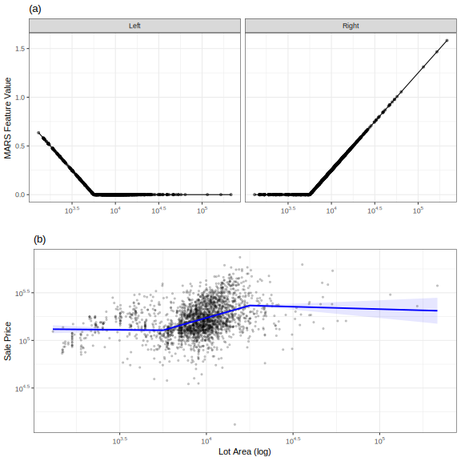

# Engineering Numeric Predictors

```{r message=FALSE, warning=FALSE, include=FALSE}
# ------------------------------------------------------------------------------
# Feature Engineering and Selection: A Practical Approach for Predictive Models
# by Max Kuhn and Kjell Johnson
#
# ------------------------------------------------------------------------------
# 
# Code for Section 6.1 at
# https://bookdown.org/max/FES/numeric-one-to-one.html
#
# ------------------------------------------------------------------------------
# 
# Code requires these packages: 

library(caret)
library(tidymodels)
library(tidyverse)

theme_set(theme_bw() + theme(legend.position = "top"))

# ------------------------------------------------------------------------------

data("segmentationData")

# ------------------------------------------------------------------------------

segmentationData$Cell <- NULL
segmentationData <- segmentationData[, c("EqSphereAreaCh1", "PerimCh1", "Class", "Case")]
names(segmentationData)[1:2] <- paste0("Predictor", LETTERS[1:2])

example_train <- subset(segmentationData, Case == "Train")
example_test  <- subset(segmentationData, Case == "Test")

example_train$Case <- NULL
example_test$Case  <- NULL

simple_trans_rec <- recipe(Class ~ ., data = example_train) %>%
  step_BoxCox(PredictorA, PredictorB) %>%
  prep(training = example_train)

simple_trans_test <- bake(simple_trans_rec, example_test)
pred_b_lambda <-
  tidy(simple_trans_rec, number = 1) %>% 
  filter(terms == "PredictorB") %>% 
  select(value)

bc_before <- ggplot(example_test, aes(x = PredictorB)) + 
  geom_histogram(bins = 35, col = "blue", fill = "blue", alpha = .6) + 
  xlab("Predictor B") + 
  ggtitle("(a)")
bc_after <- ggplot(simple_trans_test, aes(x = PredictorB)) + 
  geom_histogram(bins = 35, col = "red", fill = "red", alpha = .6) + 
  xlab("Predictor B (inverse)") + 
  ggtitle("(b)")


```

**Learning objectives:**

-   Learn about common issues and techniques when handling continuous predictors<br><br>
-   Often dealing with continuous predictors can be corrected by the model you select
    -   Skewed data? Use tree-based methods

        -   K-nearest neighbor and support vector machines should be avoided

    -   Highly correlated variables? Use Partial Least Squares

        -   Multiple linear regression and neural networks should be avoided\
            <br><br>
-   Feature Engineering techniques to:
    -   Address problematic characteristics of individual predictors

    -   Expand individual predictors to better represent complex relationships

    -   Consolidate redundant information

## Problematic Characteristics of predictors

One of the first things we can do when transforming our data is to rescale it to improve model performance. There are several different methods that can be used in different situations. Box-Cox and Yeo Johnson transformations can be used to correct for highly skewed predictors. Standardizing strategies such as scaling, centering, and smoothing can also be used to ensure your predictors have similar qualities.

### Dealing with Skewed Data

**Do a Box-Cox Transformation!**

Originally developed to transform the outcome variable, box-cox uses maximum likelihood estimation to estimate a transformation parameter λ. The transformation allows the data to follow a normal distribution. The plot below shows the before and after effects.\

```{r box_cox, echo=FALSE, fig.dim = c(8, 8)}

library(patchwork)

pw = bc_before / bc_after
pw + plot_annotation(
  caption = 'The distribution of a skewed predictor before (a) and after (b) applying the Box-Cox transformation.'
)
```

#### What does a Box-Cox transformation do?

Because the estimated parameter is in the exponent, it is called a POWER transformation. Different values of the parameter mimick no transformation (1), log transformation (0), square root (0.5), or inverse (-1). Because it is so flexible it can handle many different types of distributions

-   Several caveats:

    -   Can only be used when predictors are greater or equal to 0

    -   Yeo-Johnson transformation can be used when there are negative values.

    -   Best used for models that use polynomial transformations like linear regression, neural networks, or support vector machines.\

#### Logit Transformation

Proportions, or data that falls between 0 and 1, are a special case that warrants their own transformation! Sometimes when a proportion is the outcome variable, model predictions can include results that are outside these bounds. Using a **logit transformation**, we can correct for that by changing the values between negative and positive infinity. If π is the variable, the logit transformations is:

$$
logit(π) = log(\frac{π}{1-π})
$$

After the predictions are calculated, you can use the inverse logit to return the data to its original form.

### Standardizing

**Why standardize?** When your predictors are all in different units, with varying ranges, some may have an out-sized influence on the outcome when that should not be the case. This is especially true for models that use a distance computation like kNN, PCA, SVM, lasso and ridge regression, and variable importance calculation. Logistic regression and tree based methods not so much....

The main techniques illustrated in the book are centering, scaling, and smoothing sequential (time) data.

#### Centering and Scaling

**Centering** is pretty straight forward. For each variable, every value is subtracted by its average. After which, all variables will have a mean of zero.

**Scaling** is the process of dividing a variable by the corresponding training set's standard deviation. This ensures that that variables have a standard deviation of one.

In addition to improving model performance, centering and scaling can also help better interpret our models for a couple reasons

1.  It is easier to interpret the y-intercept when the predictors have been centered and scaled

2.  Centering allows for an easier interpretation of coefficients with different magnitudes\

#### Time data: Smoothing

When your model uses sequential, or time related, there can be a lot of noise in your model. By computing a running average,or a running median, we can *smooth* out our predictor and reduce noise. These are computed by taking the average of a point and one point before and after. The size of the moving window is extremely important. Small windows might not involve much smoothing at all, and large windows may miss out on important trends.

Computing the running median is especially important when there are major outliers in your sequential data.


## Expanding Numeric Transformations

Just like we can expand qualitative features into multiple useful columns, we can also take one numeric predictor and expand it into several more. The following subsection divides these expansions into two categories: nonlinear features via basis expansions and splines, and discretize predictors

### Nonlinear Features via Basis Expansions and Splines

#### Basis Expansions

REMINDER: A basis is a set of vectors V such that every vector V can be written uniquely as a finite combination of vectors of the basis.

[{width="227"}](https://en.wikipedia.org/wiki/Basis_(linear_algebra))

A basis expansion takes a feature $x$ and derives a set of functions $f_i(x)$ that can be combined using a linear combination, sort of like polynomial contrasts in the previous categorical section. A **cubic basis expansion** would produce two additional features, a squared and a cubed version of the original. $\beta$ terms are computed for each feature using linear regression.

But what if these trends are not linear throughout the prediction space?

{width="423"}

#### Polynomial Splines

Polynomial splines can be used for basis expansion instead of typical linear regression to divide the prediction space into regions, whose boundaries are called knots. Each region can have its own fitted set of polynomial functions, which can describe complex relationships.

Usually you select percentiles to create the knots. Determining the number of knots can be done by doing a grid search, a visual inspection of the results, *generalized cross-validation* (GCV) which is used in some spline functions.

The previous methods were created prior to being exposed to the outcome variable, but that doesn't have to be the case. *Generalized Additive Models* (GAMS) work very similarly to polynomial splines, and can adaptively model multiple different basis functions for each predictor. *Loess* regression is also a supervised nonlinear smoother.


Lastly, a multivariate adaptive regression spline (MARS) model includes a single knot, or hinge transformation.



### Discretize Predictors as a Last Resort

If we discretize a predictor, or turn it into categorical, we are essentially binning the data. Unsupervised approaches to binning are rather straight forward using percentiles or the median, but they can also be set based on specific cut-off points to improve performance.

The books mentions many reason why this should NOT be done. Despite simplifying modeling, you lose much of the nuance. Discretizing your predictors can make it harder to model trends, it can increase the probability of modeling a relationship that is not there, and the cut-off points are rather arbitrary.


## New Features from Multiple predictors

The previous two sections focused on adjusting our features and creating new features from a single predictor, but we can also create new features from all of our predictors at once. This can correct issues like multicollinearity and outliers, while also reducing the dimensionality and speeding up computation times.

There are a ton of different techniques for this that are essentially broken down into four main parts: linear projections, autoencoders, Spatial sign, and Distance and Depth features.

### Linear Projection Methods

More predictors is not always better! Especially if you have redundant information. This section is all about identifying meaningful projections of the original data. The unsupervised methods, like PCA, tend not to increase model performance, yet they do save computational time. Supervised approaches, like partial least squares, DO however if you have enough data to prevent overfitting.

#### Principal Component Analysis (PCA)

PCA finds a linear combination of the original predictors that summarizes the maximum amount of variation. Since they are orthogonal, the predictor space is partitioned in a way that does not overlap. (uncorrelated)


We can see from the graph below that the first component USUALLY contains the most information. We can also see that some methods do much better than others.


Visualizing the principal components with a heat map can help us identify which predictors are impacting each component. The figure below visualizes the Chicago train dataset. We can see after the first component that lines are clustered together meaning the line probably has an effect on our outcome.

```{r pca_heatmap,fig.dim = c(8, 12), echo=FALSE, message=FALSE, warning=FALSE}

library(caret)
#library(NMF)
library(fastICA)
library(tidymodels)
library(kernlab)
library(pls)
library(RColorBrewer)
library(leaflet)
library(htmltools)
library(dimRed)
library(heatmaply)
library(lobstr)

# The memory requires for this script are about 8GB although see the note below
# regarding NNMF (which can be much higher)

mem_in_gb <- function() {
  res <- as.numeric(mem_used()) * 1e-9
  cat(round(res, 1), "GB\n")
  invisible(NULL)
}

# ------------------------------------------------------------------------------

# For plots
source(url("https://raw.githubusercontent.com/topepo/FES/master/06_Engineering_Numeric_Predictors/6_3_1_Linear_Projection_Methods/chicago_maps.R"))

# ------------------------------------------------------------------------------


load(url("https://github.com/topepo/FES/blob/master/Data_Sets/Chicago_trains/chicago.RData?raw=true"))


# ------------------------------------------------------------------------------

weekends <-
  training %>%
  dplyr::filter(dow %in% c("Sat", "Sun")) %>%
  dplyr::select(matches("l14_[0-9]"), s_40380)

stations <-
  stations %>%
  mutate(terms = gsub("s_", "l14_", station_id))

#mem_in_gb()

# ------------------------------------------------------------------------------
# Emulate the rolling origin forecast resampling but for weekends

weekend_days <- train_days[training$dow %in% c("Sat", "Sun")]

wend_slices <- createTimeSlices(weekend_days, initialWindow = 1600, horizon = 4, fixedWindow = FALSE)
wend_ctrl <- ctrl
wend_ctrl$index <- wend_slices$train
wend_ctrl$indexOut <- wend_slices$test
wend_ctrl$verboseIter <- FALSE
wend_ctrl$allowParallel <- FALSE

# ------------------------------------------------------------------------------

simple_rec <- recipe(s_40380 ~ ., data = weekends)

set.seed(7599)
simple_mod <-
  train(simple_rec, data = weekends, method = "lm", trControl = wend_ctrl) %>%
  pluck("resample") %>%
  mutate(model = "Original Predictors")

#mem_in_gb()

# ------------------------------------------------------------------------------

pca_rec <-
  simple_rec %>%
  step_center(matches("l14_[0-9]")) %>%
  step_scale(matches("l14_[0-9]")) %>%
  step_pca(matches("l14_[0-9]"), num_comp = 20)

pca_rec_tr <-
  pca_rec %>%
  prep(training = weekends, verbose = TRUE)

pca_features <- juice(pca_rec_tr, matches("^PC"))

pca_cor <- apply(pca_features, 2, cor, y = weekends$s_40380, method = "spearman")
pca_cor <- pca_cor[order(-abs(pca_cor))]
pca_cor

#mem_in_gb()

# ------------------------------------------------------------------------------

# Compute the % variation for each component
sds <- pca_rec_tr$steps[[3]]$res$sdev
pct_var <- (sds^2)/sum(sds^2)*100
cum_var <- cumsum(pct_var)

# Get component values
pca_coefs <-
  tidy(pca_rec_tr, number = 3) %>%
  dplyr::select(-id) %>%
  spread(component, value) %>%
  dplyr::select(terms, PC1, PC2, PC3, PC4, PC5) %>%
  full_join(stations, by = "terms")

# Get a different version used for the heatmap
five_pca_coefs <-
  pca_coefs %>%
  as.data.frame() %>%
  na.omit()

rownames(five_pca_coefs) <- five_pca_coefs$description

five_pca_coefs <-
  five_pca_coefs %>%
  dplyr::select(starts_with("PC"))

# ------------------------------------------------------------------------------

five_comps_range <-
  tidy(pca_rec, number = 3) %>%
  mutate(value = abs(value)) %>%
  pull(value) %>%
  max(na.rm = TRUE)

# https://bookdown.org/max/FES/engineering-numeric-predictors.html#fig:numeric-heatmap-html
heatmaply(
  five_pca_coefs,
  cexRow = .5,
  Colv = FALSE,
  branches_lwd = .5,
  colors = RdBu(50),
  label_format_fun = function(...) round(..., digits = 3),
  limits = c(-five_comps_range, five_comps_range),
  margins = c(50,215,10,150)
)

```

#### Kernel PCA

PCA is really effective when the predictors are linearly correlated, but what if the relationship is not actually linear but quadratic? That's were kernel PCA comes in. There are MANY different kernels based on the shape of the predictor space (Polynomial, Gaussian etc), so you really need to inspect your data before setting kPCA up.

Because kPCA is more flexible, it can often lead to much better results. The firgure below shows how using basic PCA would actually lead to a poor fit.


#### Independent Component Analysis

PCA components are uncorrelated with each other, but they are often not independent.That's where ICA comes in! ICA is similar to PCA except that it components are also as statistically independent as possible. Unlike PCA, there is no ordering in ICA.

Preprocessing is essential for ICA. Predictors must be centered and then **"whitened"**, which means that PCA is calculated BEFORE ICA, which seems rather odd.

#### Non-negative factorization

-   when features are greater than or equal to zero. Most popular for text data! where the predictors are word counts, imaging, and biological measures.\

#### Partial Least Squares

PLS is supervised version of pca that guides dimension reduction optimally related to the response. Finds latent variables that have optimal covariance with the response. Because of this supervized approach, you generally need fewer components than PCA, BUT you risk overfitting.


#### Autoencoders

Computationally complex multivariate method for finding representations of the predictor space, primarily used in deep learning. Generally they don't have any actual interpretation but they have some strengths. Autoencoders are really good when there is a large amount of unlabled data.

Example: used in the pharmaceutical industry to estimate how good a drug might be based on its chemical structure. To simulate a drug discovery project just starting up, a random set of 50 data points were used as a training set and another random set of 25 were allocated to a test set. The remaining 4327 data points were treated as unlabeled data that do not have melting point data.


#### Spatial Sign

Spatial Sign is primarily used in image analysis, transforms the predictors based on their center to the distribution and projects them onto an nD sphere.


**THE EXAMPLE THEY GIVE INVOLVES CLASSIFYING IMAGES OF ANIMAL POOP!**

Spatial sign is really good at decreasing impact of outliers.

#### Distance and depth features

Distance and Depth Features take a semi-supervised approach for classification problems. Predictors are recomputed based on the distance to class centroid, sort of like knearest neighbor.


## Meeting Videos

### Cohort 1

`r knitr::include_url("https://www.youtube.com/embed/URL")`

<details>

<summary>Meeting chat log</summary>

    LOG

</details>
