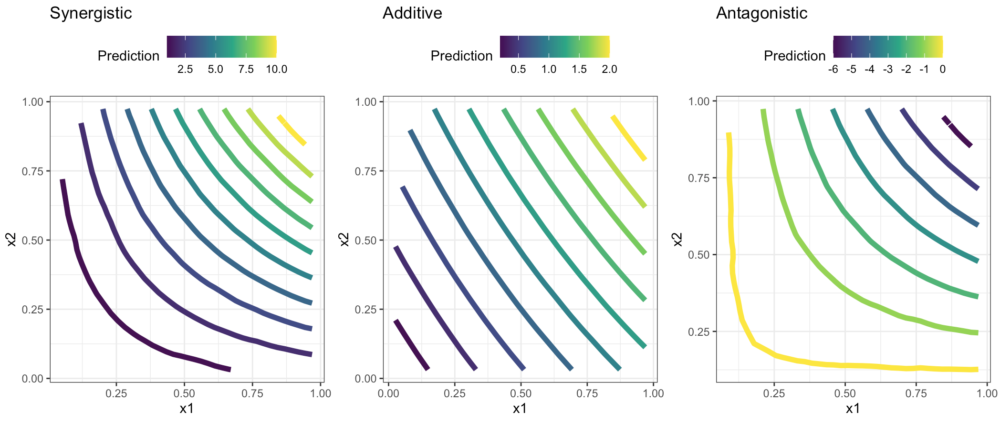
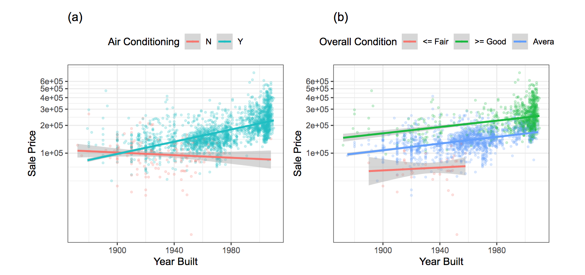
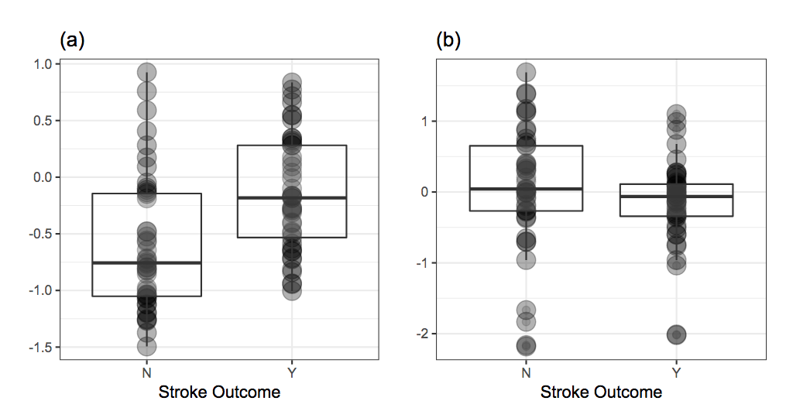
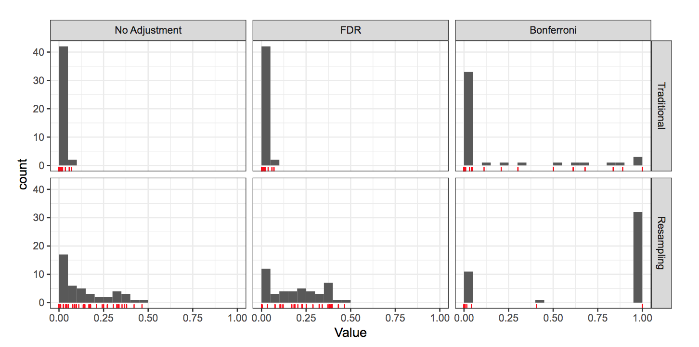
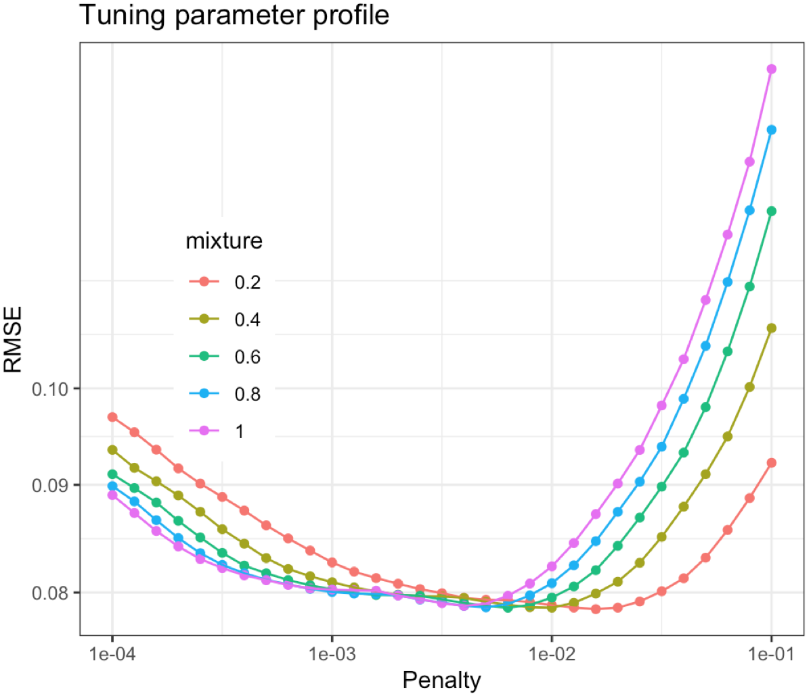
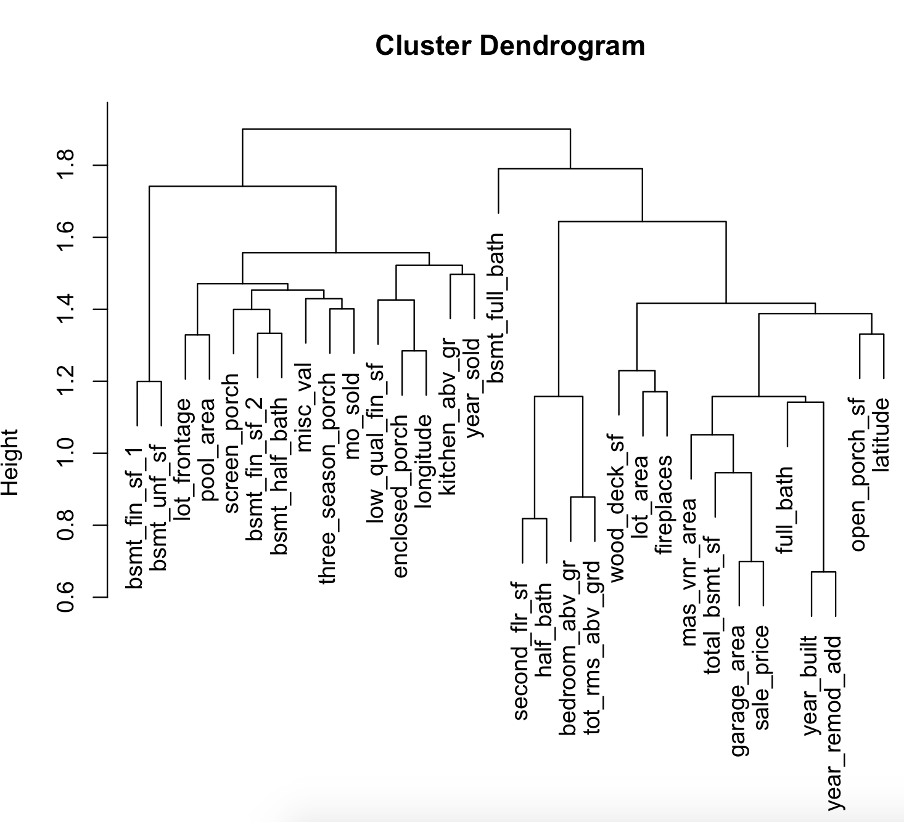
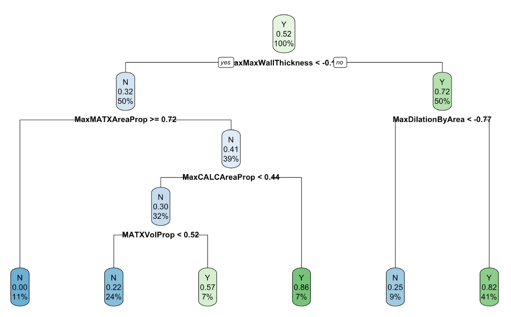

# Detecting Interaction Effects

**Learning objectives:**

- how predictors relate to the outcome
- when to apply for **interaction effects**
- how to make predictions selection for looking to key interactions


## Introduction

In this chapter we will be looking at the interaction effects caused by predictors acting together on the response variable. 

> ...additional variation in the response can be explained by the effect of two or more predictors working in conjunction with each other.


As an example consided are the effects of water and fertilizer on the yield of a field corn crop. "With no water but some fertilizer, the crop of field corn will produce no yield since water is a necessary requirement for plant growth. Conversely, with a sufficient amount of water but no fertilizer, a crop of field corn will produce some yield. However, yield is best optimized with a sufficient amount of water and a sufficient amount of fertilizer. Hence water and fertilizer, when combined in the right amounts, produce a yield that is greater than what either would produce alone."


> predictors are said to interact if their combined effect is different (less or greater) than what we would expect if we were to add the impact of each of their effects when considered alone. 


- Correlations between predictors, for example, are not directly related to whether there is an interaction effect or not

- The individual variables (e.g., fertilizer and water) are referred to as the **main effect** terms when outside of an interaction.


## Four type of Interactions

1. additive       is when $\beta_3 \approx{0}$
2. antagonistic   is when $\beta_3 < 0$  
3. synergistic    is when $\beta_3 > 0$  
4. atypical       is when $\beta_3 \neq 0$  


The main difference is that in the atypical interaction one of the two predictors doesn't affect the response.

```{r 07-detecting-interaction-effects-1, echo=FALSE}

```

see full code in the scripts folder: **1_geom_contour.R**

```{r 07-detecting-interaction-effects-2, message=FALSE, warning=FALSE, paged.print=FALSE}
library(tidyverse)
# simulated data
set.seed(123)
beta0<- rep(0,200)
beta1<- rep(1,200)
beta2<- rep(1,200)
x1<- runif(200,min = 0, max = 1)
x2 <- runif(200,min = 0, max = 1)
e <- rnorm(200)
```


```{r 07-detecting-interaction-effects-3, message=FALSE, warning=FALSE, include=TRUE, paged.print=FALSE}
##################################################
# synergism
beta3<- rep(10,200) # c(-10,0,10) # antagonism, no interaction, or synergism

y = beta0 + beta1*x1 + beta2*x2 + beta3*(x1*x2) + e

observed<- tibble(y,x1,x2)

mod <- lm(y~x1*x2,observed)
observed$z <- predict(mod,observed)

grid <- with(observed, interp::interp(x=x1,y=x2,z))
griddf <- subset(data.frame(x = rep(grid$x, nrow(grid$z)),
                            y = rep(grid$y, each = ncol(grid$z)),
                            z = as.numeric(grid$z)),!is.na(z))
p1 <- ggplot(griddf, aes(x, y, z = z)) +
  geom_contour(aes(colour = after_stat(level)),size=2) +
  #geom_point(data = observed,aes(x1,x2)) +
  scale_color_viridis_c()+
  labs(title="Synergistic",color="Prediction",x="x1",y="x2")+
  theme_bw()+ theme(legend.position = "top")
##################################################
# no interaction
beta3 <- rep(0,200) # c(10,0,10) # antagonism, no interaction, or synergism

y = beta0 + beta1*x1 + beta2*x2 + beta3*(x1*x2) + e

observed<- tibble(y,x1,x2)

mod <- lm(y~x1*x2,observed)
observed$z <- predict(mod,observed)

grid <- with(observed, interp::interp(x=x1,y=x2,z))
griddf <- subset(data.frame(x = rep(grid$x, nrow(grid$z)),
                            y = rep(grid$y, each = ncol(grid$z)),
                            z = as.numeric(grid$z)),!is.na(z))
p2 <- ggplot(griddf, aes(x, y, z = z)) +
  geom_contour(aes(colour = after_stat(level)),size=2) +
  # geom_point(data = observed,aes(x1,x2)) +
  scale_color_viridis_c()+
  labs(title="Additive",color="Prediction",x="x1",y="x2")+
  theme_bw()+ theme(legend.position = "top")
##################################################
# antagonism
beta3<- rep(-10,200) # c(-10,0,10) # antagonism, no interaction, or synergism

y = beta0 + beta1*x1 + beta2*x2 + beta3*(x1*x2) + e

observed<- tibble(y,x1,x2)

mod <- lm(y~ x1 * x2 , data = observed)  # rnd effects (1 + x1 | x2)
observed$z <- predict(mod,observed)

grid <- with(observed, interp::interp(x=x1,y=x2,z))
griddf <- subset(data.frame(x = rep(grid$x, nrow(grid$z)),
                            y = rep(grid$y, each = ncol(grid$z)),
                            z = as.numeric(grid$z)),!is.na(z))
p3 <- ggplot(griddf, aes(x, y, z = z)) +
  geom_contour(aes(colour = after_stat(level)),size=2) +
  # geom_point(data = observed,aes(x1,x2)) +
  scale_color_viridis_c()+
  labs(title="Antagonistic",color="Prediction",x="x1",y="x2")+
  theme_bw()+ theme(legend.position = "top")
```


```{r 07-detecting-interaction-effects-4, echo=FALSE, message=FALSE, warning=FALSE, paged.print=FALSE}
# ames_glmnet
load(url("https://github.com/topepo/FES/blob/master/07_Detecting_Interaction_Effects/7_04_The_Brute-Force_Approach_to_Identifying_Predictive_Interactions/ames_glmnet.RData?raw=true"))
```

```{r 07-detecting-interaction-effects-5, echo=FALSE, message=FALSE, warning=FALSE, paged.print=FALSE}
# ames_glmnet_two_stage
load(url("https://github.com/topepo/FES/blob/master/07_Detecting_Interaction_Effects/7_04_The_Brute-Force_Approach_to_Identifying_Predictive_Interactions/ames_glmnet_two_stage.RData?raw=true"))
```

```{r 07-detecting-interaction-effects-6, echo=FALSE, message=FALSE, warning=FALSE, paged.print=FALSE}
# ames_pairwise
load(url("https://github.com/topepo/FES/blob/master/07_Detecting_Interaction_Effects/7_04_The_Brute-Force_Approach_to_Identifying_Predictive_Interactions/ames_pairwise.RData?raw=true"))
```

Visualizing interaction effects for the Ames data:
```{r 07-detecting-interaction-effects-7, echo=FALSE}

```

see full code in the scripts folder: **2_manipulate.R**


The general model function for interaction effects:

$$y=\beta_0+\beta_1x_1+\beta_2x_2+\beta_3x_1x_2+\text{error}$$


```{r 07-detecting-interaction-effects-8, echo=FALSE}
### Predict ischemic stroke
load(url("https://github.com/topepo/FES/blob/master/Data_Sets/Ischemic_Stroke/stroke_data.RData?raw=true"))
```


**Which predictors interact?**

> interaction can be uncovered by more complex modeling techniques


- tree-based models
- random forests
- boosted tree model
- search techniques and svm

Feature engineering helps improving the effectiveness of a models by featuring selection of predictors, so as a consequence simplify the detection of interaction effects.


### Building the base-model for **Ames** data

Here are the predictors divided by type, we will be looking at different ways to make a selection of the predictors and what are the best interactions for this data, which will be influencing model preformance.

```{r 07-detecting-interaction-effects-9}
library(AmesHousing)
ames <- make_ames() %>%
  janitor::clean_names()

ames1 <- 
  ames %>%  # names%>%sort
  select(# continuous
         gr_liv_area,lot_area,
         lot_frontage,year_built,
         year_sold,pool_area,longitude,
         latitude,full_bath,
         # qualitative
         neighborhood,bldg_type,
         central_air,ms_sub_class,
         foundation,roof_style,alley,
         garage_type,land_contour)
```


##  Guiding Principles in the Search for Interactions


**Statistical experimental design** to establish casual relationships between independent and dependent variables, foresees:

- control
- randomization
- replication

Interactions can be of different degrees:
```{r 07-detecting-interaction-effects-10, echo=FALSE}
DiagrammeR::mermaid("
graph LR
A(x1)---B(x2)
B---C(x3)
C-->D[x1 * x2]
C-->E[x1 * x3]
C-->F[x2 * x3]
D---G[x1 * x2 * x3]
E---G
F---G
")
```

The identification of the interactions can be challenging, and even more challenging can be the identification of the **shepherd interaction** effects.

The framework for identifying significant interactions (Wu ans Hamada 2011) for **experimental design** and **predictive modeling** is based on:

- interaction hierarchy (degree of interaction)
- effect sparsity (only a fraction of the interaction effects can be effective)
- effect heredity (implies significant factors preceding interaction explain the most of the response)

    - strong heredity (interaction only with significant preceeding factors)
    - weak heredity (any interaction with one significant factor)


High order interaction happen in real life data (interactions among species).


##  Practical Considerations

- **Is it possible to identify all possible predictive interactions?**

- **Is it possible to evaluate all possible interactions?**

- **Should the interaction terms be created before or after the preprocessing part?**

Only a fraction of all possible pairwise interactions contain relevant information.

With $p$ predictors we have $(p)(p-1)/2$ pairwise interaction terms.

Here is the difference in interaction effects before and after preprocessing:  

```{r 07-detecting-interaction-effects-11, echo=FALSE}

```


## The Brute-Force Approach to Identifying Predictive Interactions

> False discoveries can influence model performance


### Simple Screening

Base-line approach is to evaluate the performance with **nested** statistical models:

$$y=\beta_0+\beta_1x_1+\beta_2x_2+\text{error}$$

$$y=\beta_0+\beta_1x_1+\beta_2x_2+\beta_3x_1x_2+\text{error}$$


see full code in the scripts folder: **3_comparisons_nested_models.R**

**Objective function**: 

- for linear regression is the **statistical likelihood** (residual error) 
- for logistic regression is the **binomial likelihood**


Evaluation methods:

1. The **residual error** (stat. likelihood) is compared and the **hypothesis test** evaluated with the **p-value** level to find differences between the results of estimations with and without interaction. If significant differences are found, p-value < 0.05, there is less than 5% chance that the results are due to randomness. This is the case for **false discoveries**.

2. **Resampling** and assessment evaluation. 

3. Use of **metrics** for visualizing the model performance: ROC, AUC, sensitivity, specificity, accuracy 


**Methods for controlling false discoveries:**

1. **Bonferroni correction** (exponential penalty)
2. **False discovery Rate (FDR)**


```{r 07-detecting-interaction-effects-12, echo=FALSE}

```


see the code: [Bonferroni and FDR adj](https://github.com/topepo/FES/blob/master/07_Detecting_Interaction_Effects/7_04_The_Brute-Force_Approach_to_Identifying_Predictive_Interactions/ames_pairwise.R)


For example, in case of the Ames data, using resampling and choosing the potential **interaction with the smallest p-value**, latitude and longitude appear to be interesting interaction factors, but this would require more investigations, to understand if this interaction is significant.

The next step would be to compare the nested models with the **ANOVA** method.

see an example: "comparisons_nested_models.R"


### Penalized Regression

One-at-a-time fashion evaluation of interaction terms, creates interaction terms to be added in the dataset. This method increases the number of predictors.


Models to use when there are more predictors than observations:

- trees
- svm
- neural networks
- k-nearest neighbors
- penalized models (less interpretable, but allow for linear/logistic regression)


**How do we start with evaluating regression models?**


**Minimize sum of squared errors**
$$SSE=\sum_{i=1}^n{(y_i-\hat{y_i})^2}$$

$$\hat{y_i}=\hat{\beta_1}x_1+\hat{\beta_2}x_2+...+\hat{\beta_p}x_p$$


In case of penalized models:

**Ridge regression**: $\lambda_r$ is called a **penalty**. To achieve better results, as regression coefficients grow large, the level of the penalty should rise. The penalty causes the resulting regression coefficients to become smaller and shrink towards zero. For *combating collinearity*.
$$SSE=\sum{i=1}^n{(y_i-\hat{y_i})^2}+\lambda_r\sum_{j=1}^P{\beta_j^2}$$

**Lasso**: the least absolute shrinking, a modification to the **ridge optimization criteria** for the *selection of predictors*.

$$SSE=\sum{i=1}^n{(y_i-\hat{y_i})^2}+\lambda_l\sum_{j=1}^P{|\beta_j|}$$


Approaches for blending both types of penalties together: **glmnet model**

$$\lambda=\lambda_r+\lambda_l$$
where is $\alpha$ is the proportion of $\lambda$ associated with **lasso** penalty:

- full lasso: $\alpha=1$
- mix: $\alpha=0.5$
- full ridge: $\alpha=0$

$$SSE=\sum_{i=1}^n{(y_i-\hat{y_i})^2}+\lambda [(1-\alpha)\sum_{j=1}^P{\beta_j^2+\alpha\sum_{j=1}^P{|\beta_j|}]}$$

### Practical example with Ames data and glmnet

```{r 07-detecting-interaction-effects-13, echo=FALSE, message=FALSE, warning=FALSE, paged.print=FALSE}
ames%>%
  ggplot(aes(x = I(year_built*gr_liv_area), y=sale_price))+
  geom_point(alpha=0.5)+
  geom_smooth()+
  scale_x_log10()+
  scale_y_log10()+
  labs(title="Top selected interaction relationship",
       x = "Year Built * Living Area",
       y="Sale Price")+
  theme_bw()
```


see full code in the scripts folder: **5_ames_modeling.R**

```{r 07-detecting-interaction-effects-14, echo=FALSE}

```


## Approaches when Complete Enumeration is Practically Impossible

### Guiding Principles and Two-stage Modeling

Two-stage Modeling is another approach to use:

1. use simple models such as lm or glm then add interaction effects
2. use models ready for considering interactions

In the residuals are the predictors missing information. 

#### Example

Observed data are $y$ and $x_1$, we know nothing about $x_2$, and so $x_1*x_2$.

$$y=x_1+x_2+10x_1x_2+\text{error}$$

$$y=\beta_1x_1+x_2+\text{error*}$$

$$\text{error*}=\beta_2x_2+\beta_3x_1x_2+\text{error}$$
Random measurement error remains unexplained.

- hierarchy principle: first look at pairwise interactions
- sparsity principle: look for active interactions
- heredity principle: search for interactions among the predictors identified in the first stage
- choose the type of heredity: determine the number of interaction terms

For classification outcome (categorical response) the **Pearson residual** should be used:

$$\frac{y_i-p_i}{\sqrt{p_i(1-p_i)}}$$

### Tree-based Methods

> "Tree-based models are usually thought of as pure interaction due to their prediction equation, which can be written as a set of multiplicative statements."

- tree-based methods uncover potential interactions between variables
- recursive partitioning identifies important interactions among predictors

> "In essence, the partitioning aspect of trees impedes their ability to represent smooth, global interactions."

Moreover, a tree-based model does well at approximating the level of interaction but, it breaks the space into rectangular regions, and needs many regions to capture all possible interactions. 

For this reason, ensembles of trees such as **bagging** (many samples of the original data generated with replacement) and **boosting** (sequence of trees with restricted depth, improved performance and weighted stats) are better performers.

Here is a representation of the clusters for Ames data:
```{r 07-detecting-interaction-effects-15, echo=FALSE}

```

Here is the outcome of a basic decision tree for the Ischemic Stroke data:

see full code in the scripts folder: **6_ames_hclust.R**
```{r 07-detecting-interaction-effects-16, echo=FALSE}

```

Tree ensembles are so effective at identifying predictor-response relationships because they are aggregating many trees from slightly different versions of the original data.

An example is **Random Forest** which is a variation of **bagging**.

**Partial dependency** compares the joint effect of two (or more) predictors with the individual effect of each predictor in a model. This comparison is named **H** statistic, which is 0 if no interaction is found and >0 otherwise.

More about the **H** statistic can be found in [Friedman and Popescu 2008](http://www.feat.engineering/references.html#ref-friedman2008predictive).


see full code in the scripts folder: **7_ames_H_stat.R**
see the code: [Ames trees example with H statistic](https://github.com/topepo/FES/blob/master/07_Detecting_Interaction_Effects/7_05_Approaches_when_Complete_Enumeration_is_Practically_Impossible/ames_trees.R)


**Out-of-bag (OOB)** samples: Random forest uses bootstrap samples to create many models to be used in the ensemble. Since the bootstrap is being used, each tree has an associated assessment set (historically called the out-of-bag (OOB) samples) that we not used to fit the model.

To be mentioned is this interesting package: [pre package](https://github.com/marjoleinF/pre)

### The Feasible Solution Algorithm


A preselction is done before searching for interaction among predictors. When **linear and logistic models** are used some predictor selection methods are applied:

- **Forward selection**: It starts with no predictors and select the best one, then select the second best and so on...

- **Backward selection**: It starts with all predictors and make a selection based on least contribution on optimization.

- **Stepwise selection**: It adds and removes predictors at a time at each step based on optimization criteria, until model's results negatively impact model performance.

- **FSA**: The **feasible solution algorithm** (Miller's approach extended by Hawkins) to find the optimal subset. Miller's approach with 10 predictors, randomly select 3 of the predictors among all the others. It makes a model selecting one of the three predictors. Then the other two are modeled against all the remaining ones. If any of the new added predictors gives a better result, the first predictor is chosen. Then more swapping is performed among the first three predictors against all the others, untile the best one is found, or until it **converges**.

**Hawkins' extension**:

- q: random starts
- m: terms in the subset
- p: predictors

The space is $q\text{ x }m\text{ x }p$, in general the space is $p^m$.

**Lambert's approach** add the **interaction** selection to the **FSA** algorithm.

[See the code for FSA Application to Ames data](https://github.com/topepo/FES/blob/master/07_Detecting_Interaction_Effects/7_05_Approaches_when_Complete_Enumeration_is_Practically_Impossible/ames_fsa.R)


## Other Potentially Useful Tools

- **Multivariate adaptive regression splines (MARS)** is a nonlinear modeling technique for a continuous response

- MARS has also been extended to classification outcomes, and this method is called **flexible discriminant analysis (FDA)**.

- **Cubist** (Kuhn and Johnson 2013) is a rule-based regression model that builds an initial tree and decomposes it into set of rules that are pruned and perhaps eliminated.


## Conclusion

It is challeging to detect all the real interacting effects on a data set with many predictors. A good advice from the expert in the field of data could be key to identify predictors that are force of interaction for that specific data. In addition, the application of pairwise interaction selection is still to be applied for looking at possible changes that might apply to data overtime.


## Meeting Videos

### Cohort 1

`r knitr::include_url("https://www.youtube.com/embed/uYOGgrRvjXQ")`

<details>
<summary> Meeting chat log </summary>

```
01:09:27	Ricardo Serrano:	FWDselect
```
</details>
