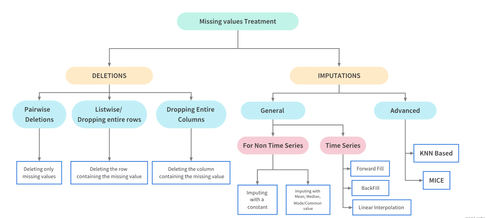

# Handling Missing Data

**Learning objectives:**

-   Identify types of missing data
-   Understand the nature and severity of missing data
-   Perform visualizations for missing data
-   Methods to treat/cope with missing data (deletion, imputation)

## Types of missing data

Three common mechanisms:

-   Structural deficiencies in the data (example: AMES dataset)
-   Random occurrences (MCAR)
-   Specific causes (MAR, MNAR)

[Source: Little, R, and D Rubin. 2014. Statistical Analysis with Missing Data. John Wiley; Sons.](https://www.gbv.de/dms/ilmenau/toc/33682193X.PDF)

## Missing data mechanisms

-   Missing Completely at Random (MCAR)

     - Locations of missing values in the dataset are purely random, they do not depend on any other data.
     
     - Example: A weather sensor is measuring temperature and sending the data to a database. There are some missing entries in the database for when the sensor broke down.
     
     - MCAR test (`naniar` package)
     
-   Missing at Random (MAR)

     - Locations of missing values in the dataset depend on some other, observed data.
     
     - Example: There are some missing temperature values in the database for when the sensor was switched off for maintenance. As the maintenance team never work on the weekends, the locations of missing values depend on the day of the week.

-   Missing Not at Random (MNAR)

     - Locations of missing values in the dataset depend on the missing values themselves.
     
     - Example: When it's extremely cold, the weather sensor freezes and stops working. So, it does not record very low temperatures. Thus, the locations of missing values in the temperature variable depend on the values of this variable themselves.

## Statistical Rethinking (Bayesian) Chapter 20 - Missing Data & Other Opportunities

`r knitr::include_url("https://www.youtube.com/embed/UgLF0aLk85s")`

Comment: Missing data lecture start at approximately at 32:00

## Why detecting the missing data mechanism is important?

-   Imputation methods make assumptions on the type of missing data mechanism.

-   Most machine learning algorithms do not accept data with missing values (see section 8.2 - Models that are Resistant to Missing Values).

-   Justifies the strategy to deal with missing data.

{height=800px width=800px}

## Visualizing Missing Information

```{r load_libraries, echo=FALSE}
suppressMessages(library(tidyverse))
library(caret)
library(DataExplorer)
library(naniar)
library(visdat)
theme_set(theme_bw())
```

Load `scat` dataset
```{r load_scat}
data(scat)
scat %>% 
     glimpse()
```

Skim `scat`
```{r scat_skim}
skimr::skim(scat) %>% 
     knitr::kable()
```

Plot missing values
```{r vis_dat}
vis_dat(scat)
```

```{r plot_miss}
scat %>% 
     plot_missing()
```

```{r vis_miss}
vis_miss(scat)
```

Plot pattern of missingness using an upset plot
```{r upset_plot}
gg_miss_upset(scat, nsets = 7)
```

MCAR test
```{r mcar_test}
mcar_test(scat)
```

The MCAR hypothesis test result in a p-value < 0.05, indicating that the missing data mechanism is not random.

## Exploring pairwise relationships between predictors

Plot a scatterplot with diameter' vs 'mass' with 'flat' indicator (fig. 8.2)
```{r scatterplot}
scat_flat <- 
     scat %>%
     mutate(flat = ifelse(flat == 1, "yes", "no"))

scat_flat %>% 
     ggplot(aes(col = flat)) + 
     geom_point(aes(x = Diameter, y = Mass), alpha = .5) + 
     geom_rug(data = scat_flat[is.na(scat_flat$Mass),], 
              aes(x = Diameter), 
              sides = "b", 
              lwd = 1)+ 
     geom_rug(data = scat_flat[is.na(scat_flat$Diameter),], 
              aes(y = Mass), 
              sides = "l", 
              lwd = 1) + 
     theme(legend.position = "top")
```

```{r scat_cor}
scat_flat_NA <- scat %>% 
     mutate(diameter_NA = are_na(Diameter) %>% as.numeric())

cor(scat_flat_NA$flat, scat_flat_NA$diameter_NA)
```

## Missing Values for the Chicago ridership data

```{r load_Chicago_datasets, echo=FALSE}
load(url("https://github.com/rserran/FES/blob/master/Data_Sets/Chicago_trains/chicago.RData?raw=true"))

load(url("https://github.com/rserran/FES/blob/master/Data_Sets/Chicago_trains/chicago_raw_entries.RData?raw=true"))

load(url("https://github.com/rserran/FES/blob/master/Data_Sets/Chicago_trains/stations.RData?raw=true"))
```

Chicago ridership raw entries
```{r only_rides}
only_rides <- 
     raw_entries %>% 
     select(-date)

only_rides %>% 
     glimpse()
```

Skim `only_rides`
```{r onle_rides_skim}
skimr::skim(only_rides)
```

Select stations with missing values only
```{r}
only_rides %>% 
     select_if(~any(is.na(.))) %>% 
     plot_missing()
```

MCAR test
```{r mcar_test_stations}
mcar_test(only_rides)
```

Plot pattern of missingness using an upset plot
```{r upset_plot_stations}
gg_miss_upset(only_rides, nsets = 10)
```

Stations 40500 (Washington), 41680 (Oakton-Skokie), 41510 (Morgan), 41690 (Cermak-McCormick Place) and 41580 (Homan) missing values are highly related.

## Missing data patterns for stations originally in the Chicago ridership data

Fig. 8.5
```{r fig_8_5}
miss_entries <- 
     raw_entries %>%
     dplyr::select(-date) %>%
     is.na() 
miss_num <- apply(miss_entries, 2, sum)

has_missing <- vapply(raw_entries[, -1], function(x) sum(is.na(x)) > 1, logical(1))
miss_station <- names(has_missing)[has_missing]

# do clustering on just the station data (not time) and get a reordering 
# of the stations for plotting
miss_data <- 
     raw_entries[, miss_station] %>%
     is.na()

clst <- hclust(dist(t(miss_data)))
clst_stations <- 
     tibble(
          station_id = colnames(miss_data),
          order = clst$order
     )

station_names <- 
     stations %>% 
     dplyr::select(name, station_id) %>%
     right_join(clst_stations, by = "station_id") 

station_lvl <- station_names[["name"]][station_names$order]

miss_vert <-
     raw_entries %>%
     gather(station_id, raw_entries, -date) %>%
     filter(station_id %in% miss_station) %>%
     mutate(status = ifelse(is.na(raw_entries), "missing", "complete")) %>%
     full_join(station_names, by = "station_id") %>%
     mutate(
          name = factor(name, levels = station_lvl),
          status = factor(status, levels = c("missing", "complete"))
     )

miss_vert %>%  
     ggplot(aes(x = date, y = name, fill = status)) + 
     geom_tile() + 
     ylab("") + xlab("") + 
     scale_fill_grey() + 
     theme(legend.position = 'top')
```

There are nine stations whose data are almost complete except for a single month gap. These stations are all on the Red Line and occur during the time of the Red Line Reconstruction Project that affected stations north of Cermak-Chinatown to the 95th Street station.

## Models that are Resistant to Missing Values

Many popular predictive models such as support vector machines, the glmnet, and neural networks, cannot tolerate any amount of missing values. However, certain implementations of tree-based models have clever procedures to accommodate incomplete data (ex. CART, Naive Bayes).

## Deletion of Data

When it is desirable to use models that are intolerant to missing data, then the missing values must be extricated from the data. However, one must carefully consider a number of aspects of the data prior to taking this approach.

## Encoding Missingness

When a predictor is discrete in nature, missingness can be directly encoded into the predictor as if it were a naturally occurring category. This makes sense for structurally missing values such as the example of alleys in the Ames housing data. Here, it is sensible to change the missing values to a category of “no alley.” In other cases, the missing values could simply be encoded as “missing” or “unknown.”

## Imputation methods

Another approach to handling missing values is to impute or estimate them. Missing value imputation has a long history in statistics and has been thoroughly researched. Good places to start are Little and Rubin (2014), Van Buuren (2012) and Allison (2001). In essence, imputation uses information and relationships among the non-missing predictors to provide an estimate to fill in the missing value.

Imputation methods:

-   KNN (K-Nearest Neighbors)
-   Tree-based methods (bagging, `missRanger`)
-   Linear methods

## Summary

Missing values are common occurrences in data. Unfortunately, most predictive modeling techniques cannot handle any missing values. Therefore, this problem must be addressed prior to modeling. Missing data may occur due to random chance or due to a systematic cause. Understanding the nature of the missing values can help to guide the decision process about how best to remove or impute the data.

## Meeting Videos

### Cohort 1

`r knitr::include_url("https://www.youtube.com/embed/XdB85Hw1Igo")`

<details>
<summary> Meeting chat log </summary>

```
00:07:47	Ricardo Serrano:	https://r4ds.github.io/bookclub-feat_eng/handling-missing-data.html
00:42:10	Ricardo Serrano:	naniar package
00:42:52	Federica Gazzelloni:	https://cran.r-project.org/web/packages/naniar/readme/README.html
```
</details>
