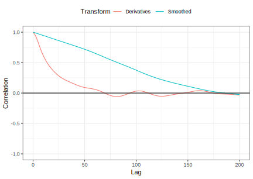

# Working with Profile Data

**What even is profile data???**


Profile data refers to datasets that have complex hierarchcical relationships.An example would be if you're trying to predict whether a student would pass a course. You might have demographic data on that student, but you'd probably also have data on the courses they took, absences grades etc.. There might also be a time component related to how quickly they're finishing their degree. There are a lot of layers to this, and feature engineering can help us create better models, insofar as we understand the data's structure.

**Learning objectives:**

-   Be able to preprocess profile data to make adequate predictions

## Illustrative Data: Pharmaceutical Manufacturing Monitoring

### Introduction

> Pharmaceutical companies use spectroscopy measurements to assess critical process parameters during the manufacturing of a biological drug (Berry et al. [2015](http://www.feat.engineering/references.html#ref-berry2015cross)). Models built on this process can be used with real-time data to recommend changes that can increase product yield. In the example that follows, Raman spectroscopy was used to generate the data^[77](http://www.feat.engineering/illustrative-data-pharmaceutical-manufacturing-monitoring.html#fn77)^ (Hammes [2005](http://www.feat.engineering/references.html#ref-hammes2005spectroscopy)). To manufacture the drug being used for this example, a specific type of protein is required and that protein can be created by a particular type of cell. A batch of cells are seeded into a *bioreactor* which is a device that is designed to help grow and maintain the cells. In production, a large bioreactor would be about 2000 liters and is used to make large quantities of proteins in about two weeks.

-   Company is trying to produce a biological drug that produces special proteins.

-   Cell are placed in a bioreactor where they produce the proteins (the yield)

-   Factors like food and temperature can be recorded, as well as cell specific cellular data like glucose production and ammonia (which can negatively impact the yield)

-   Measuring glucose and ammonia is time consuming, so spectroscopy measurements are taken from 15 small reactors and 3 large reactors.


The goal here is to see if we can take the results from the small reactors to predict the results of the big reactors.

### IMPORTANT DEFINITIONS !

**Spectroscopy** is the general field of study that measures and interprets the electromagnetic spectra that result from the interaction between electromagnetic radiation and matter as a function of the wavelength or frequency of the radiation.

**Spectra/Spectrum,** a band of colors, as seen in a rainbow, produced by separation of the components of light by their different degrees of refraction according to wavelength.

**Radiant Intensity:** In [radiometry](https://www.wikiwand.com/en/Radiometry "Radiometry"), **radiant intensity** is the [radiant flux](https://www.wikiwand.com/en/Radiant_flux "Radiant flux") emitted, reflected, transmitted or received, per unit [solid angle](https://www.wikiwand.com/en/Solid_angle "Solid angle"), and **spectral intensity** is the radiant intensity per unit [frequency](https://www.wikiwand.com/en/Frequency "Frequency") or [wavelength](https://www.wikiwand.com/en/Wavelength "Wavelength")

### Preliminary Results

Looking at the spectra over multiple days we see that the intensity exhibits similar patterns in the small and large reactors. The difference being the big reactors lead to slightly higher intensities

{width="769" height="439"}


## What are the Experimental Unit and the Unit of Prediction?

> Nearly 2600 wavelengths are measured each day for two weeks for each of 15 small-scale bioreactors. This type of data forms a *hierarchical, or nested,* structure in which wavelengths are measured within each day and within each bioreactor. The key characteristic of this is that the data within a nesting is more related than data between nestings. For example, the spectra within a day are more related to each other than between different days, AND the wavelengths within the days are more correlated with each other than wavelengths between reactors.

{alt="🤯WOW this is confusing" width="400"}

Interrelated correlations can be visualized through a plot of autocorrelations. In the plot below, we can see that the autocorrelation between wavelengths is different on different days.


Figure [9.4](http://www.feat.engineering/what-are-the-experimental-unit-and-the-unit-of-prediction.html#fig:profile-acf-bioreactor1) (b) shows the autocorrelations for the first 13 lagged days. Here correlations for the first lag is greater than 0.95, with correlations tailing off fairly quickly.

So what is the unit of prediction? Spectra? Number of days to reach a certain wavelength? Because everything inside a bioreactor is independent of other bioreactors, the unit of analysis is day within a bioreactor. Everything WITHIN a bioreactor is going to have autocorrelation.

The unit of analysis will help us decide how to use cross-validation to evaluate our results honestly. Leave one out or kfold cross validation should be used. We can't do cross validation on days or wavelengths because they're not independent units.

## Reducing Background

Excess variation due to spurious sources can have a detrimental impact on the models (the book mentions principal component regression and partial least square). Removing all the background noise is almost impossible, but we can approximate it.

> For spectroscopy data, intensity deviations from zero are called baseline drift and are generally due to noise in the measurement system, interference, or fluorescence (Rinnan, Van Den Berg, and Engelsen [2009](http://www.feat.engineering/references.html#ref-rinnan2009review)) and are not due to the actual chemical substance of the sample.

To get rid of this noise, the author uses a polynomial fit on the lowest intensities. Then they take the negative residuals and subtract those data points.


## Reducing Other Noise

There can also be systemic variation between bioreactor measurement instruments rather than difference in the amount of molecules being sampled. You saw in the graph comparing small and large bioreactors that although the peaks were the same, the intensity appeared higher for large ones. Given that these peaks are most important, we can rescale the data across reactors to ensure results are comparable.

The author uses **standard normal variate (SNV)** from spectroscopy literature to rescale the data based on the mean and standard deviation. Since these measures can be influenced by outliers, **trimming** is used to take out extreme values.

Figure [9.6](http://www.feat.engineering/reducing-other-noise.html#fig:profile-standardized) compares the profiles of the spectrum with the lowest variation and highest variation for (a) the baseline corrected data across all days and small-scale bioreactors. This figure demonstrates that the amplitudes of the profiles can vary greatly.


Another source of noise here was the intensity measurements for **EACH** wavelength within a spectrum. The author uses splines and moving averages to smooth out the intensities. The key here was to select the correct number of points to include in the moving averages.


## Exploiting Correlation

The previous two chapter were about reducing the noise , which allows us to make better predictions. However, this does not help us deal with the correlation between features -in this case the correlation between wavelengths within a spectra

One approach to dealing with correlation is principal component analysis (PCA), which gets rid of the correlation between features, but isn't guaranteed to improve the predictive power because the output isn't taken into account.

{width="600" height="500"}

Figure 9.8: PCA dimension reduction applied across all small-scale data. (a) A scree plot of the cumulative variability explained across components. (b) Scatterplots of Glucose and the first three principal components.

Using PCA, the 80% of the variation can be explained by using just 11 components, seen in the scree plot above. That being said, each component does not contain contain much predictive power to the response. For this reason, partial least squares should have been used. *(Not sure why they didn't?)*

A second approach to deal with the correlation is to take the first-order derivative within each profile. To compute first-order differentiation, the response at the $(p−1)^{st}$ value in the profile is subtracted from the response at the $p^{th}$ value in the profile. This difference represents the rate of change of the response between consecutive measurements in the profile. Larger changes correspond to a larger movement and could potentially be related to the signal in the response. This means that the autocorrelation between profiles should be greatly reduced.



We can see in **Figure 9.9** that using the first order derivatives dramatically takes out autocorrelation after the 3rd day lag.

### Altogether\~

Taken altogether, subsequent preprocessing steps nearly eliminate within-spectra drift and most of the trends that are unrelated to the peaks have been minimized.


## Impacts of Data Processing on Modeling

All of these preprocessing steps can be considered tuning parameters, where different combinations of preprocessing and models are tested.

### Cross Validation

In this case, our dataset is tiny with 15 small bioreactors that contain 14 daily measurements. Because of the size, we can try out leave-one-out and kfold cross validation.

| **Resample** | **Heldout Bioreactor** |
|-------------:|:-----------------------|
|            1 | 5, 9, and 13           |
|            2 | 4, 6, and 11           |
|            3 | 3, 7, and 15           |
|            4 | 1, 8, and 10           |
|            5 | 2, 12, and 14          |

Both of these CV methods are at risk of being influenced by one unusual hold out or fold. For that reason, it's best to increase the number of repeats with kfold CV. The book recommends 5 repeats, depending on the computational load required.

### Model Selection

In terms of model selection, options are limited. PCA or PLS are often used, but these should only be selected if the predictors and response is linear or planar.

For non-linear relationships, neural networks, support vector machines, or tree-based methods can be used. NN's and SVM's cannot handle profile data directly and need to be preprocessed. Tree based methods are a good option since they can handle correlated features, but variable importance can be deceiving because of their inclusion.

In this section, PLS, SVM's, and NN's will be used, along with the preprocessing steps, to make comparison.


Results from cross-validation reveals several things:

1.  Subsequent preprocessing steps generally decreases RMSE
2.  Preprocessing had the biggest impact on NN's and regular SVM
3.  The biggest decline were actually in the standard deviation of the performance (the error bars)
4.  PLS after derivatives was clearly the best method overall
5.  Cubist SVM also did well after smoothing

Looking closer at PLS, we can see that preprocessing reduced both RMSE AND the number of components required. Using the derivatives on the final step, PLS only required 4 components, while the others needed around 10 to contain the same amount of variation.


Comparing PLS and the Cubist SVM we can see the positive impact preprocessing has on the observed vs predicted plots. Without preprocessing, the models are quite biased. After taking the derivatives the predictive power significantly improves.


It's important to note that the above modeling approach used the bioreactors as the unit of analysis because the days within them would be correlated. If cross-validation would have been done on the days instead of the bioreactors, the RMSE would have been small, but we would have an overlly optimistic interpretation of our results.

Across all models and all profile preprocessing steps, the hold-out RMSE values are artificially lower when day is used as the experimental unit as compared to when bioreactor is used as the unit. Ignoring or being unaware that bioreactor was the experimental unit would likely lead one to be overly optimistic about the predictive performance of a model.


## Summary

Profile data has a specific structure, can be over time, have highly correlated features, and contain a hierarchical structure. Understanding the experimental unit is essential to make decisions around preprocessing and evaluation.

> Basic preprocessing steps for profiled data can include reducing baseline effect, reducing noise across the profile, and harnessing the information contained in the correlation among predictors.

No one set of preprocessing steps or model will work best in every situation. Finding the right combination, along with using expert knowledge, can produce a very effective model.


## Meeting Videos

### Cohort 1

`r knitr::include_url("https://www.youtube.com/embed/URL")`

<details>
<summary> Meeting chat log </summary>

```
LOG
```
</details>
