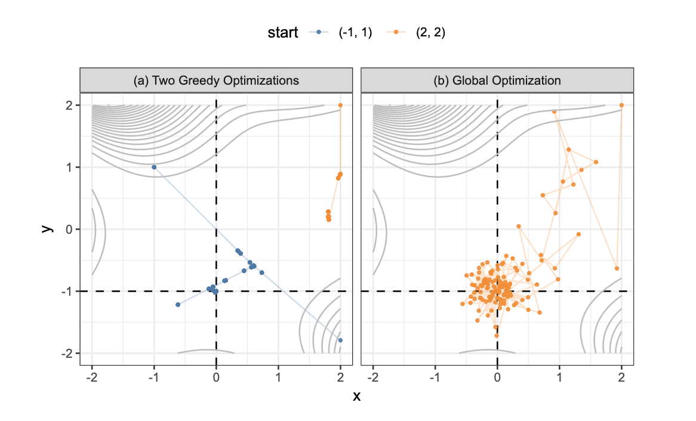
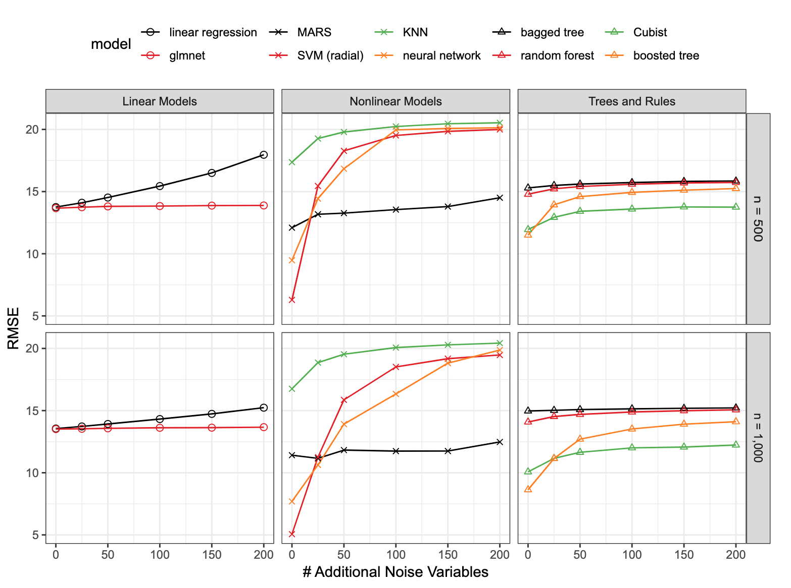
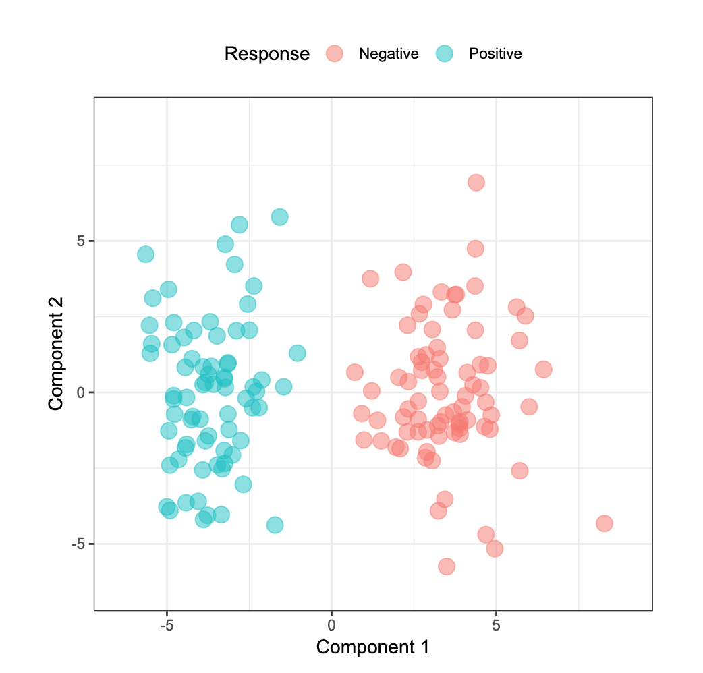

# Feature Selection Overview

**Learning objectives:**

- Revisit why feature selection is important 
- Learn about different feature selection methodologies
- Learn about how feature selection and hyperparameters tuning can influence overfitting 


## Introduction

This chapter is part of the last section of the book, it introduces us to **greedy** and **global** search methods for feature selection procedure, providing an overview of the methods for investigating a potential set of solutions to achieve the best model performance.


## Feature selection


**The best global solution: subset of predictors with the best performance**

...
This might be computationally expensive, removing predictors should mitigate it.

To take into consideration:

- svm and neural network are sensible to irrelevant predictors
- linear and logistic are vulnerable to correlated predictors


## Classes

**Feature selection methodologies:**

- **intrinsic** (implicit): (feature selection is **incorporated in the model**) use a **[greedy approach](https://en.Wikipedia.org/wiki/Greedy_algorithm)** that makes a locally optimal choice, identifying a narrow set of predictors.  Model examples:
    - tree-and-rule-based models- splits
    - MARS (multivariateadaptive regression spline)- create new features
    - regularization models- i.e. lasso use penalties (shrinks the predictor coeffs to abs zero)
- **filter**: initial **supervised analysis** and selection (example: [5.6](http://www.feat.engineering/text-data.html) ) uses a odds-ratio cut-off as a selector of statistical significance). It is effective a capturing large trends. (more in chapter 11)
- **wrapper**: **iterative search** for adding predictors to the model based on the model performance results. It can be **greedy**(backwards selection-RFE recursive feature elimination) or **non-greedy**. In particular, a non-greedy approach would re-evaluate combinations (GA genetic algorithms and SA simulated annealing). It incorporates randomness.


Panel a: Two greedy approaches (Goldstein_Price eq.)
Panel b: Simulated annealing
```{r fig.cap="Examples of greedy and global search methods when solving functions with continuous inputs.", echo=FALSE,fig.align='center'}

```

- If non-linear intrinsic methods has good performance, could proceed to a wrapper method combined with a non-linear model.
- If linear intrinsic methods has good performance, could proceed to a wrapper method combined with a linear model.


## Irrelevant features

**Predictability**

- type of model
- nature of the predictors
- ratio of the size of the training set to the number of predictors


This **simulation system** from **Sapp et al. (2014)** is an example of **nonlinear function** of 20 predictors:

$$y=x_1+sin(x_2)+log(|x_3|)+x_4^2+x_5x_6+I(x_7x_8x_9<0)+I(x_{10}>0)+\\
x_{11}I(x_{1}1>0)+\sqrt{|x_{12}|}+cos(x_{13})+2x_{14}+|x_{15}|+\\I(x_{16}< -1)+I(x_{17< -1})-2x_{18}-x_{19}x_{20}+\epsilon$$


Each of the $x_i$ are generated from an **independent standard normal random variable** and the $\epsilon$, the **error** as a **random normal** $\epsilon\sim N(0,3)$. 

And between 10 and 200 extra variables are added. 

source: [FES Selection Simulation](https://github.com/topepo/FES_Selection_Simulation)

```{r fig.cap="RMSE trends for different models and simulation configurations", echo=FALSE,fig.align='center'}

```

## Overfitting


Overfitting can arise because of:

- **hypeparamets overfitting**
- **feature selection overfitting**

Solutions:

- Solution to **hypeparamets overfitting** is to evaluate the **tuning parameters** on a data set that is not used to estimate the model parameters (via validation or assessment sets).

- Solution to **feature selection overfitting** is applying a resampling process. To consider is when:
  - feature selection is **external** to the resampling
  - feature selection is **inside** to the resampling:
    - the process provides a more realistic estimate of predictive performance
    - increase in computational burden


## A case study

**Incorrectly combining feature selection and resampling**

Goal: identify a subset of predictors with 80% accuracy

- 75 **samples** from each of the two classes
- 10,000 **predictors** for each data point
- 70% of the data for a **training** set
- **10-fold cross-validation** for model training
- **implicit** feature selection methods of the **glmnet** and **random forest**. 


Initial results:

- 60% best cross-validation accuracy


First adjustments approach that resulted in worst results:

- PCA for reducing dimensions
- linear discriminant analysis
- partial least squares discriminant analysis


Second adjustments approach:

> first identify and select predictors that had a univariate signal with the response


- t-test performed for each predictors
- predictors rank by significance
- top 300 predictors selected for modeling
- PCA on the 300 predictors
- plotted first two components colored by response category


```{r fig.cap="First two components obtained with: feature selection outside of resampling", echo=FALSE,fig.align='center'}

```

This second method provided a clear answer, showing a complete separation of the components.


## Conclusion


The next chapters will tell us about two search methods:

- greedy (deterministic) such as simple filters and backwards selection
- global (random) to find globally best subset


## Meeting Videos

### Cohort 1

`r knitr::include_url("https://www.youtube.com/embed/URL")`

<details>
<summary> Meeting chat log </summary>

```
LOG
```
</details>
